# AI Teaching Assistant Frontend - Technical Interview Documentation

## 📋 Quick Reference Guide

### **🏗️ Frontend Architecture Overview**
```
┌─────────────────┐    ┌─────────────────┐    ┌─────────────────┐
│   User Interface│    │  State Management│    │  External APIs  │
│   (Components)  │◄──►│   (Contexts)    │◄──►│  (LiveKit/Auth) │
└─────────────────┘    └─────────────────┘    └─────────────────┘
│                      │                      │
├─ React Components   ├─ AuthProvider       ├─ LiveKit Cloud
├─ TypeScript Types   ├─ ConnectionProvider ├─ Backend API
├─ Tailwind Styles   ├─ SettingsProvider   └─ Browser APIs
└─ Event Handlers    └─ ThemeProvider
```

### **🔧 Technology Stack Matrix**
| Layer | Technology | Purpose | Complexity |
|-------|------------|---------|------------|
| **Framework** | Next.js 15 | App Router, SSR, Optimization | 🟡 Medium |
| **Language** | TypeScript | Type Safety, Developer Experience | 🟢 Low |
| **UI Library** | React 19 | Component-based Architecture | 🟡 Medium |
| **Styling** | Tailwind CSS | Utility-first CSS Framework | 🟢 Low |
| **Real-time** | LiveKit | WebRTC Communication | 🔴 High |
| **Animation** | Framer Motion | Smooth UI Transitions | 🟡 Medium |
| **State** | Context API | Global State Management | 🟡 Medium |

### **📁 Component Hierarchy**
```
app/
├── page.tsx                 # 🎯 Root component with providers
├── components/
│   ├── auth/               # 🔐 Authentication components
│   ├── ui/                 # 🎨 Base UI components
│   ├── room.tsx            # 🔗 LiveKit connection
│   ├── playground.tsx      # 🎮 Main interface
│   ├── text-input.tsx      # ⌨️ User input handling
│   └── typewriter.tsx      # ✍️ AI response display
├── hooks/
│   ├── use-auth.tsx        # 🔐 Authentication state
│   ├── use-connection.tsx  # 🔗 LiveKit connection
│   └── use-settings.tsx    # ⚙️ User preferences
└── utils/                  # 🛠️ Helper functions
```

### **🔄 Component Communication Flow**
```
User Action → Event Handler → Hook → Context → State Update → Re-render
     ↑                                                           ↓
     └─────────────── UI Update ←─────────────────────────────────┘
```

---

## Project Overview

This is a **modern React-based frontend** built with **Next.js 15** that provides an interactive AI teaching assistant interface. The application uses **TypeScript** for type safety, **LiveKit** for real-time communication, **Tailwind CSS** for styling, and follows **React best practices** with hooks and context for state management.

### Core Technologies Explained (For Beginners)

#### **What is JavaScript?**
- **JavaScript** is a programming language that runs in web browsers
- It makes websites interactive (clicking buttons, updating content, animations)
- Originally created for simple web interactions, now powers complex applications

#### **What is React?**
- **React** is a JavaScript library created by Facebook for building user interfaces
- Think of it like building with LEGO blocks - you create small reusable pieces (components) that combine to make a complete application
- **Components** are like custom HTML elements that can have their own logic and appearance
- **Example**: A `Button` component can be reused throughout the app with different text and actions

#### **What is TypeScript?**
- **TypeScript** is JavaScript with **type checking** - it helps catch errors before they happen
- **Types** tell you what kind of data a variable should hold (string, number, boolean, etc.)
- **Example**: `const name: string = "John"` - this ensures `name` can only be a text value

#### **What is Next.js?**
- **Next.js** is a framework built on top of React that adds useful features
- **Framework** = a set of tools and conventions that make development easier
- Provides **routing** (different pages), **server-side rendering**, and **optimization**

#### **What is Node.js?**
- **Node.js** allows JavaScript to run on servers (not just in browsers)
- The frontend uses Node.js tools for development (building, testing, managing dependencies)
- **Package Manager**: Tools like `npm` or `pnpm` install and manage code libraries

### Frontend Architecture Overview

```
Frontend Structure:
├── app/                    # Next.js app directory (main pages)
├── components/             # Reusable UI components
├── hooks/                  # Custom React hooks (state management)
├── lib/                    # Utility libraries
├── utils/                  # Helper functions
├── config/                 # Configuration files
└── public/                 # Static assets (images, icons)
```

### Key Concepts for Interview

#### **React Hooks Explained**
- **Hooks** are special functions that let you "hook into" React features
- **useState**: Stores and updates data that can change
- **useEffect**: Runs code when component mounts or data changes
- **useContext**: Shares data between components without passing props
- **Custom Hooks**: Your own hooks that combine multiple React features

#### **Component Lifecycle**
1. **Mount**: Component is created and added to the page
2. **Update**: Component re-renders when data changes
3. **Unmount**: Component is removed from the page

#### **State Management**
- **Local State**: Data that belongs to one component (useState)
- **Global State**: Data shared across multiple components (Context API)
- **Props**: Data passed from parent to child components

---

## File-by-File Technical Analysis

### 1. `app/page.tsx` - Main Application Entry Point

**Purpose**: The root component that sets up the entire application with providers and routing logic.

**Key Concepts Explained**:

#### **"use client" Directive**
```typescript
"use client";
```
- **What it means**: This tells Next.js this component runs in the browser (client-side)
- **Why needed**: Next.js can render components on the server or client - this forces client-side
- **When to use**: When you need browser features (localStorage, event listeners, interactive state)

#### **React Imports**
```typescript
import { useEffect } from "react";
```
- **useEffect**: **[IMPORT: React hook]** - Runs side effects (API calls, event listeners, cleanup)
- **What is a side effect**: Any operation that affects something outside the component

#### **Component Imports with Path Aliases**
```typescript
import { RoomComponent } from "@/components/room";
```
- **@/ syntax**: **[PATH ALIAS: TypeScript/Next.js]** - shortcut for the project root directory
- **Why useful**: Instead of `../../../components/room`, you write `@/components/room`

#### **Provider Pattern Explained**
```typescript
<ThemeProvider>
  <SettingsProvider>
    <AuthProvider>
      <ConnectionProvider>
        <AppContent />
      </ConnectionProvider>
    </AuthProvider>
  </SettingsProvider>
</ThemeProvider>
```

**What is the Provider Pattern?**
- **Providers** wrap components to share data without passing props down manually
- **Context API**: React's built-in way to share state globally
- **Nesting Order**: Outer providers are available to inner providers and components

**Detailed Logical Flow**:

#### **`Home()` Function (Lines 15-27) - DETAILED BREAKDOWN**

**Step 1: Provider Hierarchy Setup - What Actually Happens**

**1.1: ThemeProvider Wrapper (Outermost Layer)**
```typescript
<ThemeProvider>
```
- **What it does**: Creates a React Context that holds theme state (dark mode vs light mode)
- **Internal mechanism**: Uses `useState` to track current theme, `useEffect` to persist to localStorage
- **Why outermost**: Every single component in the app needs access to theme colors and styling
- **Data provided**: `{ theme: 'dark' | 'light', toggleTheme: () => void, setTheme: (theme) => void }`
- **Real impact**: When theme changes, ALL components re-render with new CSS classes

**1.2: SettingsProvider Wrapper (Second Layer)**
```typescript
<SettingsProvider>
```
- **What it does**: Manages user preferences like volume, auto-speak, teaching mode, sidebar visibility
- **Internal mechanism**:
  - Uses `useState` with default settings object
  - `useEffect` loads settings from localStorage on mount
  - Provides `updateSettings` function that merges new settings with existing ones
- **Why second**: Settings might depend on theme (e.g., different volume levels for different themes)
- **Data provided**: `{ settings: SettingsObject, updateSettings: (partial) => void, resetSettings: () => void }`
- **Real impact**: Components can read user preferences and adjust behavior accordingly

**1.3: AuthProvider Wrapper (Third Layer)**
```typescript
<AuthProvider>
```
- **What it does**: Manages user authentication state, login/logout, token validation
- **Internal mechanism**:
  - Uses multiple `useState` hooks for user, token, loading, error states
  - `useEffect` on mount checks localStorage for existing token and validates it
  - Provides login/logout functions that make API calls and update state
- **Why third**: Authentication is needed before establishing real-time connections
- **Data provided**: `{ user: User | null, token: string | null, isAuthenticated: boolean, login: Function, logout: Function }`
- **Real impact**: Determines which components are rendered (login page vs main app)

**1.4: ConnectionProvider Wrapper (Innermost Layer)**
```typescript
<ConnectionProvider>
```
- **What it does**: Manages LiveKit connection state and token generation
- **Internal mechanism**:
  - Uses `useState` to track connection details (wsUrl, token, shouldConnect flag)
  - Provides `connect` function that fetches token from API and updates state
  - Provides `disconnect` function that sets shouldConnect to false
- **Why innermost**: Needs authenticated user before establishing real-time connection
- **Data provided**: `{ wsUrl: string, token: string, shouldConnect: boolean, connect: Function, disconnect: Function }`
- **Real impact**: Controls whether LiveKit room component attempts connection

**1.5: AppContent Rendering (Core Component)**
```typescript
<AppContent />
```
- **What it does**: Contains the main application logic and conditional rendering
- **Access to all providers**: Can use `useTheme()`, `useSettings()`, `useAuth()`, `useConnection()`
- **Why innermost**: Needs access to all the context data to make rendering decisions

### **🔗 Provider Dependency Chain**


### **📊 Provider Data Flow Matrix**
| Provider | Provides | Depends On | Impact |
|----------|----------|------------|---------|
| **Theme** | `theme`, `toggleTheme` | None | All components |
| **Settings** | `settings`, `updateSettings` | Theme colors | UI behavior |
| **Auth** | `user`, `token`, `login`, `logout` | Settings prefs | App access |
| **Connection** | `wsUrl`, `token`, `connect` | Auth token | Real-time features |

### **🔄 Connection Flow Visualization**


**Memory and Performance Impact**:
- **Context Re-renders**: When any provider state changes, all child components re-render
- **Optimization**: Each provider uses `useMemo` for context value to prevent unnecessary re-renders
- **Provider Isolation**: Changes in ThemeProvider don't trigger AuthProvider re-creation

#### **`AppContent()` Function (Lines 29-71) - DETAILED BREAKDOWN**

**Step 1: Hook Usage for State Access - What Actually Happens**

**1.1: Connection State Extraction**
```typescript
const { shouldConnect, disconnect } = useConnection();
```
- **What happens internally**:
  - `useConnection()` calls `React.useContext(ConnectionContext)`
  - Context provider returns current state object: `{ wsUrl, token, shouldConnect, connect, disconnect }`
  - Destructuring extracts only the needed properties
- **shouldConnect purpose**: Boolean flag that tells LiveKit whether to attempt connection
- **disconnect purpose**: Function that sets shouldConnect to false and cleans up connection
- **Why destructuring**: Only extract what you need, prevents unnecessary re-renders

**1.2: Authentication State Extraction**
```typescript
const { isAuthenticated, isLoading } = useAuth();
```
- **What happens internally**:
  - `useAuth()` calls `React.useContext(AuthContext)`
  - Context calculates `isAuthenticated = !!user && !!token` (converts to boolean)
  - `isLoading` tracks whether auth check is in progress
- **isAuthenticated purpose**: Determines if user can access main app
- **isLoading purpose**: Shows loading spinner while checking stored token validity

**Step 2: Event Listener Setup - Deep Dive into Side Effects**

**2.1: useEffect Hook Mechanics**
```typescript
useEffect(() => {
  const handleUserLogout = () => { ... };
  window.addEventListener('user-logged-out', handleUserLogout);
  return () => window.removeEventListener('user-logged-out', handleUserLogout);
}, [disconnect]);
```

**What happens step-by-step**:
1. **Component Mount**: useEffect runs after first render
2. **Function Definition**: `handleUserLogout` is created in memory
3. **Event Registration**: Browser adds this function to its event listener registry
4. **Dependency Tracking**: React remembers `disconnect` function reference
5. **Cleanup Registration**: Return function is stored for later cleanup

**2.2: Event Handler Logic**
```typescript
const handleUserLogout = () => {
  try {
    disconnect();
  } catch (error) {
    // Silently handle disconnect errors
  }
};
```
- **Why try-catch**: `disconnect()` might fail if connection is already closed
- **Silent error handling**: User logout should always succeed, even if disconnect fails
- **Function scope**: Has access to `disconnect` through closure

**2.3: Cleanup Mechanism**
- **When cleanup runs**: Component unmount OR `disconnect` function changes
- **Why cleanup needed**: Prevents memory leaks from orphaned event listeners
- **Browser impact**: Removes function from browser's event listener registry

**Step 3: Conditional Rendering Logic - Decision Tree Analysis**

**3.1: Loading State Check (First Priority)**
```typescript
if (isLoading) {
  return (
    <div className="h-screen w-full bg-bg-primary flex items-center justify-center">
      <div className="animate-spin rounded-full h-12 w-12 border-t-2 border-b-2 border-primary-DEFAULT"></div>
    </div>
  );
}
```
- **Why first**: Must show loading before making any other decisions
- **CSS breakdown**:
  - `h-screen w-full`: Takes full viewport height and width
  - `bg-bg-primary`: Uses theme-aware background color
  - `flex items-center justify-center`: Centers spinner both horizontally and vertically
  - `animate-spin`: Tailwind CSS animation that rotates element 360° continuously
  - `border-t-2 border-b-2`: Creates partial border that appears to spin

**3.2: Authentication Check (Second Priority)**
```typescript
if (!isAuthenticated) {
  return <AuthPage />;
}
```
- **Why second**: Only check auth after loading is complete
- **Component responsibility**: `<AuthPage />` handles login/register forms
- **State isolation**: Auth page has its own state management for form inputs

**3.3: Connection State Check (Final Decision)**
```typescript
return (
  <div className="h-screen w-full bg-bg-primary overflow-hidden">
    {shouldConnect ? <RoomComponent /> : <ConnectionPage />}
  </div>
);
```
- **Why last**: Only relevant for authenticated users
- **RoomComponent**: Renders when user is connected to LiveKit room
- **ConnectionPage**: Shows connection button and status when not connected
- **Container styling**:
  - `overflow-hidden`: Prevents scrollbars on main container
  - Ensures consistent layout regardless of which component renders

### **🎭 Rendering State Machine**

```mermaid
stateDiagram-v2
    [*] --> Loading: App Starts
    Loading --> AuthPage: isLoading=false, !isAuthenticated
    Loading --> ConnectionPage: isLoading=false, isAuthenticated, !shouldConnect
    Loading --> RoomComponent: isLoading=false, isAuthenticated, shouldConnect

    AuthPage --> ConnectionPage: User Logs In
    ConnectionPage --> RoomComponent: User Clicks Connect
    RoomComponent --> ConnectionPage: User Disconnects
    ConnectionPage --> AuthPage: User Logs Out

    Loading: 🔄 Checking Authentication
    AuthPage: 🔐 Login/Register Forms
    ConnectionPage: 🔗 Connection Controls
    RoomComponent: 🎮 Main Application
```


**Performance Considerations**:
- **Early returns**: Prevents unnecessary component creation
- **Conditional rendering**: Only one major component rendered at a time
- **State dependencies**: Each condition depends on previous state resolution

**Variable Roles**:
- `shouldConnect`: Boolean flag determining if LiveKit connection should be active
- `disconnect`: Function to terminate LiveKit connection
- `isAuthenticated`: Boolean indicating if user is logged in
- `isLoading`: Boolean indicating if auth check is in progress

**Cross-References**:
- `useConnection()` → **[EXTERNAL HOOK: hooks/use-connection.tsx]**
- `useAuth()` → **[EXTERNAL HOOK: hooks/use-auth.tsx]**
- `window.addEventListener()` → **[BROWSER API: Web API]**
- Tailwind classes → **[EXTERNAL LIBRARY: tailwindcss]**

---

### 2. `hooks/use-auth.tsx` - Authentication State Management

**Purpose**: Manages user authentication state, login/logout functionality, and token validation using React Context API.

**Key Concepts Explained**:

#### **React Context API**
```typescript
const AuthContext = createContext<AuthContextType | undefined>(undefined);
```
- **createContext**: **[REACT FUNCTION]** creates a context object for sharing data
- **Generic Type**: `<AuthContextType | undefined>` tells TypeScript what data type this context holds
- **Why undefined**: Initial value before provider is set up

#### **TypeScript Type Definitions**
```typescript
type User = {
  id: string;
  username: string;
};

type AuthContextType = {
  user: User | null;
  token: string | null;
  // ... more properties
};
```
- **type**: **[TYPESCRIPT KEYWORD]** defines the shape of data
- **Union Types**: `User | null` means the value can be either a User object OR null
- **Object Types**: Define what properties an object must have

#### **React Provider Component**
```typescript
export const AuthProvider = ({ children }: { children: React.ReactNode }) => {
```
- **children**: **[REACT PATTERN]** represents any components wrapped by this provider
- **React.ReactNode**: **[TYPESCRIPT TYPE]** any valid React element (components, text, etc.)

**Detailed Logical Flow**:

#### **State Initialization (Lines 27-31)**
- `useState<User | null>(null)` → **[REACT HOOK]** creates `user` state, initially null
- `useState<string | null>(null)` → **[REACT HOOK]** creates `token` state, initially null
- `useState<boolean>(true)` → **[REACT HOOK]** creates `isLoading` state, initially true
- `useState<string | null>(null)` → **[REACT HOOK]** creates `error` state, initially null

**What is useState?**
- Returns array with 2 elements: `[currentValue, setterFunction]`
- **Example**: `const [count, setCount] = useState(0)`
- When setter is called, component re-renders with new value

#### **Authentication Check on Mount (Lines 34-65) - DETAILED BREAKDOWN**

**Step 1: useEffect Setup - Component Lifecycle Deep Dive**
```typescript
useEffect(() => {
  const checkAuth = async () => { ... };
  checkAuth();
}, []);
```

**What happens in React's lifecycle**:
1. **Component Creation**: AuthProvider component is instantiated
2. **Initial Render**: Component renders with initial state (user: null, isLoading: true)
3. **Effect Scheduling**: React schedules useEffect to run after render
4. **Effect Execution**: `checkAuth()` function is called
5. **Async Execution**: Function runs asynchronously, doesn't block UI

**Why empty dependency array `[]`**:
- **Mounting only**: Effect runs once when component mounts
- **No re-runs**: Won't run again unless component unmounts and remounts
- **Performance**: Prevents infinite loops or unnecessary re-executions

**Step 2: Token Retrieval - Browser Storage Deep Dive**

**2.1: localStorage Access**
```typescript
const storedToken = localStorage.getItem("auth_token");
const storedUser = localStorage.getItem("auth_user");
```

**What happens in the browser**:
1. **Storage Query**: Browser checks its internal storage database
2. **Key Lookup**: Searches for exact key match ("auth_token", "auth_user")
3. **Data Retrieval**: Returns string value or null if not found
4. **Synchronous Operation**: Blocks briefly but usually very fast

**localStorage vs other storage**:
- **Persistence**: Data survives browser restart, unlike sessionStorage
- **Scope**: Available to all tabs of same origin
- **Size limit**: Usually 5-10MB per origin
- **Security**: Only accessible to same origin (domain + protocol + port)

**2.2: Data Validation**
```typescript
if (storedToken && storedUser) {
```
- **Null check**: Both `getItem()` calls return null if key doesn't exist
- **Truthy check**: Empty strings would also fail this check
- **Safety**: Prevents processing invalid/missing data

**Step 3: Token Validation Flow - Security Deep Dive**

**3.1: Immediate State Update (Optimistic UI)**
```typescript
setToken(storedToken);
setUser(JSON.parse(storedUser));
```

**Why set state immediately**:
- **User Experience**: Prevents flash of login screen for valid users
- **Optimistic Update**: Assume stored data is valid until proven otherwise
- **Performance**: Renders UI immediately while validation happens in background

**JSON.parse() Deep Dive**:
```typescript
setUser(JSON.parse(storedUser));
```
- **String to Object**: Converts JSON string back to JavaScript object
- **Error Potential**: Can throw if string is malformed JSON
- **Data Structure**: Reconstructs original user object with id, username, etc.

**3.2: Backend Verification**
```typescript
const isValid = await verifyToken(storedToken);
```

**What verifyToken() does internally**:
1. **HTTP Request**: Sends POST to `/api/auth` with token
2. **Server Validation**: Backend checks token signature, expiration, user existence
3. **Response Processing**: Returns boolean indicating validity
4. **User Data Update**: If valid, updates user data with fresh info from server

**Why verify stored tokens**:
- **Security**: Tokens can be revoked, expired, or tampered with
- **Data Freshness**: User info might have changed on server
- **Session Management**: Server might have invalidated session

**3.3: Invalid Token Handling**
```typescript
if (!isValid) {
  console.log("Stored token is invalid, clearing auth state");
  logout();
}
```

**What logout() does**:
1. **State Cleanup**: Sets user and token to null
2. **Storage Cleanup**: Removes all auth data from localStorage
3. **Event Dispatch**: Notifies other components of logout
4. **Backend Notification**: Tells server to invalidate token

**3.4: Loading State Management**
```typescript
setIsLoading(false);
```
- **Always executed**: Runs whether token is valid or invalid
- **UI Update**: Triggers re-render to hide loading spinner
- **State Consistency**: Ensures loading state is always resolved

**Error Handling Deep Dive**:
```typescript
try {
  // Token verification and state updates
} catch (err) {
  console.error("Error checking authentication:", err);
  logout();
}
```

**What errors can occur**:
- **Network errors**: API request fails due to connectivity
- **JSON parsing errors**: Stored user data is corrupted
- **Token verification errors**: Server returns unexpected response
- **State update errors**: React state updates fail

**Recovery strategy**:
- **Graceful degradation**: Always fall back to logout
- **User experience**: User sees login screen instead of broken state
- **Security**: When in doubt, clear all auth data

#### **Token Verification (Lines 68-94)**
**Step 1: API Request**
- `fetch("/api/auth", { ... })` → **[BROWSER API]** makes HTTP request to backend
- **Request Body**: JSON with `type: "verify"` and `token: tokenToVerify`
- **Headers**: `"Content-Type": "application/json"` tells server we're sending JSON

**Step 2: Response Processing**
- `response.json()` → **[FETCH API METHOD]** parses response as JSON
- Cast to `AuthResponse` type → **[TYPESCRIPT]** tells TypeScript what shape to expect
- IF `data.success` AND `data.user` exist:
  - Update user state with fresh data from server
  - RETURN `true` → indicates token is valid
- ELSE: RETURN `false` → indicates token is invalid

#### **Login Function (Lines 96-156) - DETAILED BREAKDOWN**

**Step 1: Request Preparation - State Management Deep Dive**

**1.1: Loading State Activation**
```typescript
setIsLoading(true);
```
- **UI Impact**: Triggers re-render of login form with disabled inputs and loading spinner
- **User Experience**: Prevents double-submission while request is in progress
- **State Consistency**: Ensures UI reflects current operation status

**1.2: Request Body Construction**
```typescript
body: JSON.stringify({
  type: "login",
  username,
  password,
} as AuthRequest)
```
- **Type Safety**: `as AuthRequest` ensures TypeScript validates the object structure
- **JSON Serialization**: Converts JavaScript object to JSON string for HTTP transmission
- **API Contract**: Backend expects specific format with type, username, password fields

**Step 2: API Call - HTTP Communication Deep Dive**

**2.1: Fetch API Mechanics**
```typescript
const response = await fetch("/api/auth", {
  method: "POST",
  headers: { "Content-Type": "application/json" },
  body: JSON.stringify(requestData)
});
```

**What happens in the browser**:
1. **HTTP Request Creation**: Browser creates POST request with headers and body
2. **Network Transmission**: Request sent to server over HTTP/HTTPS
3. **Server Processing**: Backend validates credentials and generates response
4. **Response Reception**: Browser receives HTTP response with status and data
5. **Promise Resolution**: `await` pauses execution until response arrives

**Headers Deep Dive**:
- **Content-Type**: Tells server the request body is JSON format
- **Why needed**: Server needs to know how to parse the request body
- **Alternative formats**: Could be form-data, XML, plain text, etc.

**2.2: Response Processing**
```typescript
const data: AuthResponse = await response.json();
```
- **JSON Parsing**: Converts response body from JSON string to JavaScript object
- **Type Assertion**: TypeScript treats result as AuthResponse type
- **Async Operation**: `.json()` is also async and needs await

**Step 3: Success Path - Authentication Flow**

**3.1: Success Validation**
```typescript
if (data.success && data.token && data.user) {
```
- **Triple Check**: Ensures response has success flag, valid token, and user data
- **Defensive Programming**: Prevents partial success scenarios
- **Type Safety**: All three properties must exist for successful login

**3.2: State Updates (Critical Section)**
```typescript
setToken(data.token);
setUser(data.user);
```
- **Order Matters**: Token set first, then user data
- **Atomic Updates**: Both states update in same render cycle
- **Context Propagation**: All components using useAuth() will re-render

**3.3: Persistent Storage**
```typescript
localStorage.setItem("auth_token", data.token);
localStorage.setItem("auth_user", JSON.stringify(data.user));
```
- **Browser Storage**: Persists authentication across browser sessions
- **JSON Serialization**: User object converted to string for storage
- **Security Consideration**: Token stored in localStorage (vulnerable to XSS)

**3.4: Success Return**
```typescript
setIsLoading(false);
return true;
```
- **Loading State Reset**: UI returns to normal state
- **Boolean Return**: Calling component knows login succeeded
- **Component Communication**: Return value used for navigation decisions

**Step 4: Error Path - Error Handling Deep Dive**

**4.1: Error Data Extraction**
```typescript
const errorMsg = data.message || "Login failed";
const errorType = data.errorType;
```
- **Fallback Message**: Provides default if server doesn't send specific message
- **Error Categorization**: `errorType` helps UI show field-specific errors
- **User Experience**: Specific errors help user understand what went wrong

**4.2: Error State Updates**
```typescript
setError(errorMsg);
setErrorType(errorType);
```
- **Error Display**: UI will show error message to user
- **Field Highlighting**: Error type determines which input field to highlight
- **State Persistence**: Error remains until user tries again or clears it

**4.3: State Update Synchronization**
```typescript
await new Promise(resolve => setTimeout(resolve, 100));
```
- **Why needed**: React state updates are asynchronous and batched
- **Race Condition Prevention**: Ensures error states are set before function returns
- **UI Consistency**: Guarantees error message appears before loading state clears

**4.4: Failure Return**
```typescript
setIsLoading(false);
return false;
```
- **Loading State Reset**: UI returns to normal state even on failure
- **Boolean Return**: Calling component knows login failed
- **Error State Preserved**: Error message remains visible to user

**Exception Handling Deep Dive**:
```typescript
try {
  // Login logic
} catch (err) {
  const errorMessage = err instanceof Error ? err.message : "Login failed";
  setError(errorMessage);
  setErrorType('unknown');
  setIsLoading(false);
  return false;
}
```

**What can go wrong**:
- **Network Errors**: No internet connection, server down, timeout
- **JSON Parsing Errors**: Server returns invalid JSON
- **Fetch Errors**: CORS issues, invalid URL, browser restrictions
- **State Update Errors**: React state updates fail (rare)

**Error Recovery Strategy**:
- **User-Friendly Messages**: Convert technical errors to readable text
- **State Cleanup**: Always reset loading state
- **Graceful Degradation**: App remains functional even when login fails
- **Error Categorization**: Unknown errors get generic handling

#### **Logout Function (Lines 196-244)**
**Step 1: Immediate State Cleanup**
- Clear all auth states: `setUser(null)`, `setToken(null)`
- **Why immediate**: Prevents UI from showing stale data

**Step 2: Browser Storage Cleanup**
- `localStorage.removeItem("auth_token")` → **[BROWSER API]** removes stored token
- `localStorage.removeItem("auth_user")` → **[BROWSER API]** removes stored user
- Loop through all localStorage keys and remove conversation data

**Step 3: Event Notification**
- `window.dispatchEvent(new Event('user-logged-out'))` → **[BROWSER API]** notifies other components
- **Custom Events**: Way for components to communicate without direct connections

**Step 4: Backend Notification**
- IF token exists → send logout request to backend to invalidate token
- Use try/catch to handle errors silently (logout should always succeed locally)

**Variable Roles**:
- `user`: Current authenticated user object or null
- `token`: JWT authentication token string or null
- `isLoading`: Boolean indicating if auth operation is in progress
- `error`: Error message string or null
- `errorType`: Specific error category for UI handling

**Cross-References**:
- `localStorage` → **[BROWSER API: Web Storage API]**
- `fetch()` → **[BROWSER API: Fetch API]**
- `JSON.parse()` → **[JAVASCRIPT FUNCTION: built-in]**
- `setTimeout()` → **[BROWSER API: Timer API]**
- `window.dispatchEvent()` → **[BROWSER API: Event API]**

---

### 3. `components/room.tsx` - LiveKit Room Connection Management

**Purpose**: Manages the LiveKit room connection, handles reconnection logic, and sets up audio processing with noise filtering.

**Key Concepts Explained**:

#### **LiveKit Integration**
```typescript
import { Room, RoomEvent, Track, LocalAudioTrack, ConnectionState } from "livekit-client";
import { LiveKitRoom, RoomAudioRenderer } from "@livekit/components-react";
```
- **livekit-client**: **[EXTERNAL LIBRARY]** Core LiveKit SDK for real-time communication
- **@livekit/components-react**: **[EXTERNAL LIBRARY]** React components for LiveKit integration
- **Room**: Main class for managing real-time connections
- **RoomEvent**: Enum of events that can happen in a room (connect, disconnect, etc.)

#### **React useMemo Hook**
```typescript
const room = useMemo(() => { ... }, [shouldConnect, connectionAttempts]);
```
- **useMemo**: **[REACT HOOK]** caches expensive calculations between re-renders
- **Dependency Array**: `[shouldConnect, connectionAttempts]` - recalculates only when these change
- **Why needed**: Creating a Room is expensive, we don't want to recreate it on every render

#### **Event-Driven Programming**
```typescript
r.on(RoomEvent.Connected, () => { ... });
r.on(RoomEvent.Disconnected, () => { ... });
```
- **Event Listeners**: Functions that run when specific events happen
- **Asynchronous**: Events can happen at any time, not in a predictable order
- **Callback Pattern**: You provide a function, LiveKit calls it when event occurs

**Detailed Logical Flow**:

#### **Component State Setup (Lines 14-16)**
- `useState(0)` → **[REACT HOOK]** creates `connectionAttempts` counter, starts at 0
- `useState(false)` → **[REACT HOOK]** creates `isReconnecting` flag, starts false
- `maxReconnectAttempts = 3` → **[CONSTANT]** maximum retry attempts before giving up

#### **Room Configuration (Lines 24-35) - DETAILED BREAKDOWN**

**Step 1: Room Creation - LiveKit Architecture Deep Dive**

**1.1: Room Instance Creation**
```typescript
const r = new Room({
  dynacast: true,
  adaptiveStream: true,
  reconnectPolicy: { ... }
});
```

**What happens internally**:
1. **Memory Allocation**: LiveKit creates room object in memory
2. **WebRTC Setup**: Initializes WebRTC peer connection infrastructure
3. **Event System**: Sets up internal event emitter for room events
4. **Configuration Storage**: Stores options for later use during connection

**1.2: Dynacast Configuration**
```typescript
dynacast: true
```
- **What it does**: Dynamically adjusts what media tracks are published based on who's subscribed
- **Performance benefit**: Saves bandwidth by not publishing video when no one is watching
- **Real-world impact**: If 10 people in room but only 3 have video enabled, only publishes to those 3
- **CPU savings**: Reduces encoding overhead for unused streams
- **Network optimization**: Prevents unnecessary data transmission

**1.3: Adaptive Stream Configuration**
```typescript
adaptiveStream: true
```
- **What it does**: Automatically adjusts video quality based on network conditions
- **Quality scaling**: Reduces resolution/bitrate when network is poor
- **User experience**: Prevents video freezing by lowering quality instead
- **Bandwidth management**: Adapts to available network capacity
- **Real-time adjustment**: Changes quality during the call as conditions change

**Step 2: Reconnection Policy - Network Resilience Deep Dive**

**2.1: Retry Configuration**
```typescript
reconnectPolicy: {
  maxRetries: 10,
  retryInterval: 1,
  maxRetryInterval: 10,
  backoffFactor: 1.5,
}
```

**Exponential Backoff Algorithm**:
- **Attempt 1**: Wait 1 second, then retry
- **Attempt 2**: Wait 1.5 seconds (1 × 1.5), then retry
- **Attempt 3**: Wait 2.25 seconds (1.5 × 1.5), then retry
- **Attempt 4**: Wait 3.375 seconds (2.25 × 1.5), then retry
- **Attempt 5**: Wait 5.06 seconds (3.375 × 1.5), then retry
- **Attempt 6**: Wait 7.59 seconds (5.06 × 1.5), then retry
- **Attempt 7**: Wait 10 seconds (capped at maxRetryInterval), then retry
- **Attempts 8-10**: Continue waiting 10 seconds between retries

**Why exponential backoff**:
- **Server protection**: Prevents overwhelming server with rapid retry attempts
- **Network congestion**: Gives network time to recover from issues
- **Battery optimization**: Reduces power consumption on mobile devices
- **User experience**: Quick initial retries for temporary glitches, longer waits for persistent issues

**2.2: Retry Limits**
```typescript
maxRetries: 10
```
- **Why 10 retries**: Balance between persistence and resource usage
- **Total time**: With backoff, takes about 45 seconds to exhaust all retries
- **User experience**: Gives enough time for temporary network issues to resolve
- **Resource management**: Prevents infinite retry loops that drain battery/CPU

**2.3: Interval Bounds**
```typescript
retryInterval: 1,      // Start with 1 second
maxRetryInterval: 10   // Cap at 10 seconds
```
- **Initial speed**: 1 second allows quick recovery from brief disconnections
- **Maximum wait**: 10 seconds prevents excessively long waits
- **User patience**: Research shows users wait ~10 seconds before giving up
- **Network reality**: Most network issues resolve within 10 seconds

**Real-World Scenarios**:

**Scenario 1: Brief WiFi Hiccup**
- Connection drops for 2 seconds
- Retry 1 (after 1 second): Fails, WiFi still down
- Retry 2 (after 1.5 seconds): Succeeds, user never notices
- Total downtime: ~3 seconds

**Scenario 2: Network Switch (WiFi to Cellular)**
- Connection drops when switching networks
- Retries 1-3: Fail while network switches
- Retry 4: Succeeds on cellular connection
- Total downtime: ~8 seconds

**Scenario 3: Server Maintenance**
- Server goes down for maintenance
- All 10 retries fail over 45 seconds
- User sees "connection failed" message
- App remains functional for offline features

**Performance Considerations**:
- **Memory usage**: Each retry attempt uses minimal memory
- **CPU impact**: Retry logic runs on background thread
- **Battery drain**: Exponential backoff minimizes power usage
- **User feedback**: Connection status shown during retry attempts

#### **Event Listener Setup (Lines 38-96)**

**Step 3a: Track Published Event (Lines 38-59)**
- `r.on(RoomEvent.LocalTrackPublished, async (trackPublication) => { ... })` → **[LIVEKIT EVENT]**
- **Purpose**: Runs when local audio/video track is published to room
- **Conditional Logic**:
  - IF track source is microphone AND track is LocalAudioTrack:
    - Import Krisp noise filter → **[DYNAMIC IMPORT]** loads library only when needed
    - Check if noise filtering is supported → **[FEATURE DETECTION]**
    - Apply noise filter to track → **[AUDIO PROCESSING]**

**What is Dynamic Import?**
```typescript
const { KrispNoiseFilter } = await import("@livekit/krisp-noise-filter");
```
- **await import()**: **[JAVASCRIPT FEATURE]** loads code only when needed
- **Why useful**: Reduces initial bundle size, loads features on demand
- **Async**: Must use await because loading takes time

**Step 3b: Connection Events (Lines 62-81)**
- `RoomEvent.Connected` → **[LIVEKIT EVENT]** fires when successfully connected
  - Reset connection attempts to 0
  - Set reconnecting flag to false
  - Dispatch custom event → **[BROWSER API]** notifies other components
- `RoomEvent.Disconnected` → **[LIVEKIT EVENT]** fires when connection lost
  - IF should still be connected AND haven't exceeded max attempts:
    - Set reconnecting flag to true
    - Increment connection attempts counter

**Step 3c: Connection State Changes (Lines 83-96)**
- `RoomEvent.ConnectionStateChanged` → **[LIVEKIT EVENT]** fires when connection state changes
- `RoomEvent.ConnectionQualityChanged` → **[LIVEKIT EVENT]** fires when network quality changes
- **Purpose**: Provides feedback about connection health to user

#### **Reconnection Logic (Lines 105-122)**
**Step 1: useEffect for Reconnection**
- `useEffect(() => { ... }, [isReconnecting, ...])` → **[REACT HOOK]** runs when reconnection state changes

**Step 2: Reconnection Attempt**
- IF `isReconnecting` is true:
  - Set timeout for 2 seconds → **[BROWSER API: setTimeout]**
  - IF should connect AND haven't exceeded max attempts:
    - IF room is disconnected → attempt to reconnect
    - `room.connect(wsUrl, token)` → **[LIVEKIT METHOD]** attempts connection
    - Use `.catch()` → **[PROMISE METHOD]** handles connection failures

**Step 3: Cleanup**
- Return cleanup function → **[REACT PATTERN]** clears timeout if component unmounts

#### **Component Rendering (Lines 124-147)**
**Step 1: Conditional Reconnection Banner**
- IF `isReconnecting` is true:
  - Show yellow banner with reconnection status
  - Display current attempt number vs maximum attempts

**Step 2: LiveKitRoom Component**
- `<LiveKitRoom>` → **[LIVEKIT COMPONENT]** handles connection and provides context
- **Props**:
  - `serverUrl={wsUrl}` → **[EXTERNAL VARIABLE: hooks/use-connection.tsx]** WebSocket URL
  - `token={token}` → **[EXTERNAL VARIABLE: hooks/use-connection.tsx]** authentication token
  - `room={room}` → **[LOCAL VARIABLE]** configured room instance
  - `connect={shouldConnect}` → **[EXTERNAL VARIABLE: hooks/use-connection.tsx]** connection flag

**Step 3: Child Components**
- `<Playground />` → **[EXTERNAL COMPONENT: components/playground.tsx]** main UI
- `<RoomAudioRenderer />` → **[LIVEKIT COMPONENT]** handles audio playback

**Variable Roles**:
- `connectionAttempts`: Counter tracking how many reconnection attempts have been made
- `isReconnecting`: Boolean flag indicating if currently trying to reconnect
- `maxReconnectAttempts`: Constant defining maximum retry attempts
- `room`: LiveKit Room instance with configuration and event listeners
- `wsUrl`: WebSocket URL for LiveKit connection
- `token`: Authentication token for LiveKit connection
- `shouldConnect`: Boolean flag controlling whether connection should be active

**Cross-References**:
- `useConnection()` → **[EXTERNAL HOOK: hooks/use-connection.tsx]**
- `useSettings()` → **[EXTERNAL HOOK: hooks/use-settings.tsx]**
- `Room` → **[EXTERNAL CLASS: livekit-client]**
- `LiveKitRoom` → **[EXTERNAL COMPONENT: @livekit/components-react]**
- `setTimeout()` → **[BROWSER API: Timer API]**
- `window.dispatchEvent()` → **[BROWSER API: Event API]**

---

### 4. `components/playground.tsx` - Main Application Interface

**Purpose**: The main UI component that orchestrates the entire application interface, including connection status, conversation management, and input handling.

**Key Concepts Explained**:

#### **Framer Motion for Animations**
```typescript
import { AnimatePresence, motion } from "framer-motion";
```
- **Framer Motion**: **[EXTERNAL LIBRARY]** React animation library
- **AnimatePresence**: **[FRAMER COMPONENT]** animates components entering/leaving the DOM
- **motion**: **[FRAMER COMPONENT]** adds animations to regular HTML elements
- **Why animations**: Improve user experience with smooth transitions

#### **Lucide React Icons**
```typescript
import { MessageSquare } from "lucide-react";
```
- **Lucide React**: **[EXTERNAL LIBRARY]** Icon library with React components
- **MessageSquare**: **[ICON COMPONENT]** specific icon for messages/conversations
- **SVG Icons**: Scalable vector graphics that look crisp at any size

#### **LiveKit React Hooks**
```typescript
import { useConnectionState, useLocalParticipant } from "@livekit/components-react";
```
- **useConnectionState**: **[LIVEKIT HOOK]** provides current connection status
- **useLocalParticipant**: **[LIVEKIT HOOK]** provides access to local user's audio/video

**Detailed Logical Flow**:

#### **Component State Setup (Lines 26-31)**
- `useLocalParticipant()` → **[LIVEKIT HOOK]** gets local participant object
- `useConnectionState()` → **[LIVEKIT HOOK]** gets current connection state
- `useSettings()` → **[EXTERNAL HOOK: hooks/use-settings.tsx]** gets user preferences
- `useState(false)` → **[REACT HOOK]** creates `showConnectionToast` flag
- `useState<ConnectionState | null>(null)` → **[REACT HOOK]** creates `lastConnectionState` tracker
- `useState(false)` → **[REACT HOOK]** creates `showMobileConversations` flag

#### **Connection State Monitoring (Lines 37-63)**
**Step 1: Connection State Change Detection**
- `useEffect(() => { ... }, [roomState, lastConnectionState])` → **[REACT HOOK]** runs when connection state changes
- **Condition Check**: IF `lastConnectionState !== roomState` AND state is one of:
  - `ConnectionState.Connected` → **[LIVEKIT ENUM]** successfully connected
  - `ConnectionState.Disconnected` → **[LIVEKIT ENUM]** connection lost
  - `ConnectionState.Reconnecting` → **[LIVEKIT ENUM]** attempting to reconnect

**Step 2: Toast Notification**
- Set `showConnectionToast(true)` → **[STATE UPDATE]** shows status message
- `setTimeout(() => setShowConnectionToast(false), 3000)` → **[BROWSER API]** hides toast after 3 seconds
- Return cleanup function → **[REACT PATTERN]** clears timer if component unmounts

**Step 3: Connection Success Handling**
- IF `roomState === ConnectionState.Connected`:
  - Dispatch storage event → **[BROWSER API]** triggers conversation manager
  - **Why storage event**: Conversation manager listens for this to reload data
  - **Delay**: `setTimeout(..., 1500)` gives connection time to stabilize

#### **Microphone Management (Lines 69-114)**
**Step 1: Connection and Participant Validation**
- `useEffect(() => { ... }, [localParticipant, roomState])` → **[REACT HOOK]** runs when participant or connection changes
- **Early Returns**: Exit if not connected or no participant available
- **Safety Check**: Verify `setMicrophoneEnabled` function exists

**Step 2: Microphone Muting Logic**
- Define `muteOnConnection()` function:
  - Check if microphone is currently enabled
  - Call `localParticipant.setMicrophoneEnabled(false)` → **[LIVEKIT METHOD]** mutes microphone
  - Use try/catch → **[ERROR HANDLING]** silently handle muting errors

**Step 3: Event Listener for Track Publishing**
- `localParticipant.on('trackPublished', handleTrackPublished)` → **[LIVEKIT EVENT]** listens for new tracks
- **Purpose**: Ensure microphone stays muted even when new tracks are published
- Return cleanup function → **[REACT PATTERN]** removes event listener

**Why Mute by Default?**
- **User Experience**: Prevents accidental audio transmission
- **Privacy**: User must explicitly enable microphone
- **Feedback Prevention**: Avoids audio feedback loops

#### **Responsive Layout Rendering (Lines 119-196)**
**Step 1: Connection Status Check**
- `isConnected = roomState === ConnectionState.Connected` → **[BOOLEAN CALCULATION]** determines if fully connected

**Step 2: Header and Toast**
- `<Header title="Teacher Assistant" />` → **[EXTERNAL COMPONENT: components/ui/header.tsx]** app header
- `<AnimatePresence>` → **[FRAMER COMPONENT]** handles toast enter/exit animations
- `<ConnectionToast>` → **[EXTERNAL COMPONENT: components/ui/status-indicator.tsx]** shows connection status

**Step 3: Mobile Conversation Drawer**
- `<MobileConversationDrawer>` → **[EXTERNAL COMPONENT: components/ui/mobile-conversation-drawer.tsx]**
- **Props**:
  - `isOpen={showMobileConversations}` → **[LOCAL STATE]** controls visibility
  - `onClose={() => setShowMobileConversations(false)}` → **[CALLBACK]** closes drawer

**Step 4: Desktop Sidebar with Animation**
- `<AnimatePresence mode="wait">` → **[FRAMER COMPONENT]** waits for exit before enter
- **Conditional Rendering**: Only show if `isConnected` AND `settings.sidebarVisible`
- `<motion.div>` → **[FRAMER COMPONENT]** animated container
- **Animation Properties**:
  - `initial={{ width: 0, opacity: 0 }}` → **[FRAMER PROP]** starting state
  - `animate={{ width: 256, opacity: 1 }}` → **[FRAMER PROP]** end state
  - `exit={{ width: 0, opacity: 0 }}` → **[FRAMER PROP]** exit state
  - `transition={{ duration: 0.35, ease: [...] }}` → **[FRAMER PROP]** animation timing

**Step 5: Main Content Area**
- **Mobile Conversation Button**: Shows on mobile when connected
- `<Typewriter typingSpeed={25} />` → **[EXTERNAL COMPONENT: components/typewriter.tsx]** displays AI responses
- `<TextInput isConnected={isConnected} />` → **[EXTERNAL COMPONENT: components/text-input.tsx]** user input

**CSS Classes Explained**:
- `flex flex-col h-screen` → **[TAILWIND]** vertical flexbox, full screen height
- `flex-1 overflow-y-auto` → **[TAILWIND]** takes remaining space, scrollable
- `md:hidden` → **[TAILWIND]** hidden on medium screens and up
- `bg-bg-secondary/80 backdrop-blur-sm` → **[TAILWIND]** semi-transparent background with blur

**Variable Roles**:
- `localParticipant`: LiveKit participant object for local user
- `roomState`: Current connection state enum value
- `settings`: User preferences object from settings hook
- `showConnectionToast`: Boolean controlling toast visibility
- `lastConnectionState`: Previous connection state for change detection
- `showMobileConversations`: Boolean controlling mobile drawer visibility
- `isConnected`: Computed boolean indicating full connection status

**Cross-References**:
- `useConnectionState()` → **[EXTERNAL HOOK: @livekit/components-react]**
- `useLocalParticipant()` → **[EXTERNAL HOOK: @livekit/components-react]**
- `useSettings()` → **[EXTERNAL HOOK: hooks/use-settings.tsx]**
- `AnimatePresence` → **[EXTERNAL COMPONENT: framer-motion]**
- `motion.div` → **[EXTERNAL COMPONENT: framer-motion]**
- `MessageSquare` → **[EXTERNAL COMPONENT: lucide-react]**
- `setTimeout()` → **[BROWSER API: Timer API]**
- `window.dispatchEvent()` → **[BROWSER API: Event API]**

---

## Package.json Analysis - Project Dependencies Explained

### **What is package.json?**
- **package.json**: **[NODE.JS FILE]** configuration file that defines project metadata and dependencies
- **Dependencies**: External libraries your project needs to function
- **Scripts**: Commands you can run (like `npm run dev` to start development server)

### **Key Dependencies Breakdown**:

#### **Core Framework Dependencies**
```json
"next": "15.1.2",
"react": "^19.0.0",
"react-dom": "^19.0.0"
```
- **next**: **[FRAMEWORK]** Next.js framework for React applications
- **react**: **[LIBRARY]** Core React library for building user interfaces
- **react-dom**: **[LIBRARY]** React library for DOM manipulation (web-specific)
- **Version Numbers**: `^19.0.0` means "19.0.0 or higher, but less than 20.0.0"

#### **LiveKit Real-Time Communication**
```json
"@livekit/components-react": "^2.6.10",
"@livekit/krisp-noise-filter": "^0.2.16",
"livekit-client": "^2.7.5"
```
- **@livekit/components-react**: **[LIBRARY]** Pre-built React components for LiveKit
- **@livekit/krisp-noise-filter**: **[LIBRARY]** AI-powered noise reduction for audio
- **livekit-client**: **[LIBRARY]** Core LiveKit SDK for real-time communication

#### **UI and Styling Libraries**
```json
"tailwind-merge": "^2.5.5",
"class-variance-authority": "^0.7.1",
"clsx": "^2.1.1",
"lucide-react": "^0.469.0",
"framer-motion": "^11.15.0"
```
- **tailwind-merge**: **[UTILITY]** Merges Tailwind CSS classes intelligently
- **class-variance-authority**: **[UTILITY]** Creates component variants with different styles
- **clsx**: **[UTILITY]** Conditionally joins CSS class names
- **lucide-react**: **[ICON LIBRARY]** Beautiful SVG icons as React components
- **framer-motion**: **[ANIMATION LIBRARY]** Powerful animations for React

#### **Development Dependencies**
```json
"typescript": "^5",
"@types/node": "^22.0.0",
"@types/react": "^19",
"eslint": "^9",
"prettier": "3.4.2",
"tailwindcss": "^3.4.1"
```
- **typescript**: **[LANGUAGE]** TypeScript compiler for type checking
- **@types/**: **[TYPE DEFINITIONS]** TypeScript type definitions for JavaScript libraries
- **eslint**: **[LINTER]** Code quality tool that finds and fixes problems
- **prettier**: **[FORMATTER]** Code formatter for consistent style
- **tailwindcss**: **[CSS FRAMEWORK]** Utility-first CSS framework

### **Scripts Explained**:
```json
"scripts": {
  "dev": "next dev --turbopack",
  "build": "next build",
  "start": "next start",
  "format": "prettier --write .",
  "lint": "next lint"
}
```
- **dev**: **[DEVELOPMENT]** Starts development server with Turbopack (faster bundler)
- **build**: **[PRODUCTION]** Creates optimized production build
- **start**: **[PRODUCTION]** Starts production server
- **format**: **[UTILITY]** Formats all code files with Prettier
- **lint**: **[UTILITY]** Checks code for errors and style issues

---

## Key Frontend Concepts for Technical Interviews

### **1. React Component Lifecycle**

#### **Functional Components with Hooks**
```typescript
function MyComponent() {
  // 1. Component Mount
  useEffect(() => {
    console.log("Component mounted");

    // 3. Cleanup (Component Unmount)
    return () => {
      console.log("Component unmounting");
    };
  }, []); // Empty dependency array = run once on mount

  // 2. Component Update
  useEffect(() => {
    console.log("Data changed");
  }, [data]); // Runs when 'data' changes

  return <div>My Component</div>;
}
```

#### **State Management Patterns**
```typescript
// Local State (single component)
const [count, setCount] = useState(0);

// Global State (multiple components)
const { user, login, logout } = useAuth(); // From Context

// Derived State (computed from other state)
const isLoggedIn = user !== null;
```

### **2. TypeScript in React**

#### **Component Props with Types**
```typescript
interface ButtonProps {
  children: React.ReactNode;  // What goes inside the button
  onClick: () => void;        // Function that returns nothing
  disabled?: boolean;         // Optional property
  variant?: 'primary' | 'secondary'; // Union type (one of these values)
}

function Button({ children, onClick, disabled = false, variant = 'primary' }: ButtonProps) {
  return (
    <button
      onClick={onClick}
      disabled={disabled}
      className={variant === 'primary' ? 'bg-blue-500' : 'bg-gray-500'}
    >
      {children}
    </button>
  );
}
```

#### **Hook Types**
```typescript
// State with specific type
const [user, setUser] = useState<User | null>(null);

// Ref with DOM element type
const inputRef = useRef<HTMLInputElement>(null);

// Effect with cleanup
useEffect(() => {
  const timer = setTimeout(() => {}, 1000);
  return () => clearTimeout(timer); // Cleanup function
}, []);
```

### **3. Async Operations in React**

#### **API Calls with Error Handling**
```typescript
const [data, setData] = useState(null);
const [loading, setLoading] = useState(false);
const [error, setError] = useState(null);

const fetchData = async () => {
  setLoading(true);
  setError(null);

  try {
    const response = await fetch('/api/data');
    if (!response.ok) {
      throw new Error('Failed to fetch');
    }
    const result = await response.json();
    setData(result);
  } catch (err) {
    setError(err.message);
  } finally {
    setLoading(false);
  }
};
```

### **4. Event Handling Patterns**

#### **Form Handling**
```typescript
const [formData, setFormData] = useState({ username: '', password: '' });

const handleInputChange = (e: React.ChangeEvent<HTMLInputElement>) => {
  const { name, value } = e.target;
  setFormData(prev => ({
    ...prev,        // Spread operator: copy existing data
    [name]: value   // Update specific field
  }));
};

const handleSubmit = (e: React.FormEvent) => {
  e.preventDefault(); // Prevent page refresh
  // Handle form submission
};
```

#### **Custom Events**
```typescript
// Dispatch custom event
window.dispatchEvent(new CustomEvent('user-logged-out', {
  detail: { userId: user.id }
}));

// Listen for custom event
useEffect(() => {
  const handleLogout = (event) => {
    console.log('User logged out:', event.detail.userId);
  };

  window.addEventListener('user-logged-out', handleLogout);

  return () => {
    window.removeEventListener('user-logged-out', handleLogout);
  };
}, []);
```

---

## Complete File Structure Analysis

### **Directory Organization**:

#### **`app/` - Next.js App Router**
- **`page.tsx`**: **[MAIN ENTRY]** Root page component, sets up providers
- **`layout.tsx`**: **[LAYOUT]** Defines HTML structure and global styles
- **`globals.css`**: **[STYLES]** Global CSS styles and Tailwind imports
- **`api/`**: **[API ROUTES]** Server-side API endpoints (if any)

#### **`components/` - Reusable UI Components**
- **`auth/`**: **[AUTH COMPONENTS]** Login, register, and auth-related UI
- **`ui/`**: **[BASE COMPONENTS]** Basic UI elements (buttons, inputs, etc.)
- **`room.tsx`**: **[LIVEKIT]** LiveKit room connection management
- **`playground.tsx`**: **[MAIN UI]** Primary application interface
- **`typewriter.tsx`**: **[ANIMATION]** Typewriter effect for AI responses
- **`text-input.tsx`**: **[INPUT]** User text input component
- **`conversation-manager.tsx`**: **[DATA]** Conversation list and management

#### **`hooks/` - Custom React Hooks**
- **`use-auth.tsx`**: **[STATE]** Authentication state management
- **`use-connection.tsx`**: **[STATE]** LiveKit connection state
- **`use-settings.tsx`**: **[STATE]** User preferences and settings
- **`use-theme.tsx`**: **[STATE]** Dark/light theme management
- **`use-conversation.ts`**: **[STATE]** Conversation data management
- **`use-web-tts.ts`**: **[FEATURE]** Text-to-speech functionality

#### **`lib/` - Utility Libraries**
- **`utils.ts`**: **[UTILITIES]** Common utility functions
- **`safe-publish.ts`**: **[LIVEKIT]** Safe data publishing utilities

#### **`utils/` - Helper Functions**
- **`conversation-utils.ts`**: **[DATA]** Conversation data processing
- **`markdown-formatter.ts`**: **[TEXT]** Markdown parsing and formatting
- **`text-cleaning.ts`**: **[TEXT]** Text sanitization and cleaning
- **`theme-utils.ts`**: **[UI]** Theme-related utility functions

#### **Configuration Files**:
- **`package.json`**: **[CONFIG]** Project dependencies and scripts
- **`tsconfig.json`**: **[CONFIG]** TypeScript configuration
- **`tailwind.config.ts`**: **[CONFIG]** Tailwind CSS configuration
- **`next.config.js`**: **[CONFIG]** Next.js configuration

---

## Common Technical Interview Questions & Answers

### **React & JavaScript Questions**

**Q: "What's the difference between `useState` and `useEffect`?"**
**A**:
- **useState**: Manages component state (data that can change). Returns current value and setter function.
- **useEffect**: Handles side effects (API calls, subscriptions, DOM manipulation). Runs after render.
- **Example**: `useState` for form input values, `useEffect` for fetching data when component mounts.

**Q: "How do you handle asynchronous operations in React?"**
**A**:
- **useEffect with async functions**: For data fetching on mount/update
- **Event handlers with async/await**: For user-triggered actions (form submission)
- **State management**: Loading, error, and success states
- **Cleanup**: Cancel requests if component unmounts

**Q: "What is the Context API and when would you use it?"**
**A**:
- **Purpose**: Share state between components without prop drilling
- **When to use**: Authentication, theme, user preferences, global settings
- **Pattern**: Provider component wraps app, consumer components use useContext hook
- **Example**: Our auth system shares user data across all components

**Q: "Explain the component lifecycle in functional components."**
**A**:
- **Mount**: Component created, useEffect with empty dependency array runs
- **Update**: Props/state change, component re-renders, useEffect with dependencies runs
- **Unmount**: Component removed, cleanup functions from useEffect run

### **TypeScript Questions**

**Q: "Why use TypeScript instead of JavaScript?"**
**A**:
- **Type Safety**: Catch errors at compile time, not runtime
- **Better IDE Support**: Autocomplete, refactoring, navigation
- **Self-Documenting**: Types serve as documentation
- **Easier Refactoring**: Compiler ensures changes don't break other code

**Q: "What are interfaces and how do you use them?"**
**A**:
- **Interfaces**: Define the shape of objects, function parameters, component props
- **Example**: `interface User { id: string; name: string; }` ensures user objects have these properties
- **Benefits**: Compile-time checking, better autocomplete, clear contracts

### **Next.js Questions**

**Q: "What are the benefits of using Next.js over plain React?"**
**A**:
- **File-based Routing**: Pages automatically created from file structure
- **Server-Side Rendering**: Better SEO and initial load performance
- **Built-in Optimization**: Image optimization, code splitting, bundling
- **API Routes**: Backend functionality in the same project

**Q: "What does 'use client' directive do?"**
**A**:
- **Purpose**: Tells Next.js this component runs in the browser (client-side)
- **When needed**: Interactive features, browser APIs, event handlers, state management
- **Default**: Next.js components run on server by default for better performance

### **LiveKit & Real-Time Communication**

**Q: "How does real-time communication work in your application?"**
**A**:
- **WebRTC**: Browser technology for peer-to-peer communication
- **LiveKit**: Service that manages WebRTC connections and routing
- **Signaling**: Exchange connection information between clients
- **Media Streams**: Audio/video data transmitted in real-time

**Q: "How do you handle connection failures?"**
**A**:
- **Reconnection Logic**: Automatic retry with exponential backoff
- **State Management**: Track connection status and attempts
- **User Feedback**: Show connection status and retry progress
- **Graceful Degradation**: App remains functional during connection issues

### **State Management Questions**

**Q: "How do you manage state in a React application?"**
**A**:
- **Local State**: useState for component-specific data
- **Global State**: Context API for shared data (auth, settings)
- **Server State**: Fetch and cache data from APIs
- **URL State**: Router for navigation and shareable state

**Q: "How do you prevent unnecessary re-renders?"**
**A**:
- **useMemo**: Cache expensive calculations
- **useCallback**: Cache function references
- **React.memo**: Prevent re-renders when props haven't changed
- **Proper dependency arrays**: Only re-run effects when necessary

### **Performance Questions**

**Q: "How do you optimize a React application?"**
**A**:
- **Code Splitting**: Load components only when needed (dynamic imports)
- **Memoization**: useMemo, useCallback, React.memo
- **Bundle Analysis**: Identify and remove unused code
- **Image Optimization**: Next.js automatic image optimization
- **Lazy Loading**: Load content as user scrolls

**Q: "How do you handle large lists efficiently?"**
**A**:
- **Virtualization**: Only render visible items
- **Pagination**: Load data in chunks
- **Debouncing**: Delay search/filter operations
- **Memoization**: Cache filtered/sorted results

---

## Key Technical Concepts Summary

### **React Patterns Used**:
1. **Provider Pattern**: Context API for global state
2. **Custom Hooks**: Reusable stateful logic
3. **Compound Components**: Components that work together
4. **Render Props**: Functions as children pattern
5. **Higher-Order Components**: Component enhancement

### **TypeScript Features Used**:
1. **Interface Definitions**: Component props, API responses
2. **Union Types**: Multiple possible values
3. **Generic Types**: Reusable type definitions
4. **Type Guards**: Runtime type checking
5. **Utility Types**: Pick, Omit, Partial for type manipulation

### **Performance Optimizations**:
1. **React.memo**: Prevent unnecessary re-renders
2. **useMemo/useCallback**: Cache expensive operations
3. **Code Splitting**: Dynamic imports for large components
4. **Image Optimization**: Next.js automatic optimization
5. **Bundle Optimization**: Tree shaking, minification

### **Error Handling Strategies**:
1. **Try-Catch Blocks**: Handle async operation errors
2. **Error Boundaries**: Catch React component errors
3. **Graceful Degradation**: App works even when features fail
4. **User Feedback**: Clear error messages and recovery options
5. **Logging**: Track errors for debugging

---

## Missing Components Documentation

### 5. `hooks/use-connection.tsx` - LiveKit Connection Management

**Purpose**: Manages LiveKit connection state, token generation, and connection lifecycle using React Context API.

**Key Concepts Explained**:

#### **Environment Variables in Next.js**
```typescript
process.env.NEXT_PUBLIC_LIVEKIT_URL
```
- **NEXT_PUBLIC_**: **[NEXT.JS CONVENTION]** prefix makes environment variable available in browser
- **Why needed**: Client-side code needs access to LiveKit server URL
- **Security**: Only variables with NEXT_PUBLIC_ prefix are exposed to browser

**Detailed Logical Flow**:

#### **Connection State Setup (Lines 24-28)**
- `useState({ wsUrl: "", token: "", shouldConnect: false })` → **[REACT HOOK]** creates connection state object
- **Initial State**: Empty URL, empty token, not connected

#### **Connect Function (Lines 30-42)**
**Step 1: Environment Validation**
- IF `process.env.NEXT_PUBLIC_LIVEKIT_URL` → **[ENVIRONMENT VARIABLE]** is not set:
  - THROW Error("NEXT_PUBLIC_LIVEKIT_URL is not set") → **[ERROR HANDLING]** prevents connection without URL

**Step 2: Token Generation**
- Call `fetch(TOKEN_ENDPOINT)` → **[BROWSER API: Fetch API]** requests token from `/api/token`
- Parse response with `.json()` → **[FETCH METHOD]** extracts JSON data
- Extract `accessToken` from response → **[DESTRUCTURING]** gets token value

**Step 3: Connection State Update**
- Call `setConnectionDetails({ wsUrl, token: accessToken, shouldConnect: true })` → **[STATE UPDATE]** enables connection

#### **Disconnect Function (Lines 44-46)**
- `useCallback(async () => { ... }, [])` → **[REACT HOOK]** memoizes function to prevent re-creation
- `setConnectionDetails(prev => ({ ...prev, shouldConnect: false }))` → **[STATE UPDATE]** disables connection while preserving URL and token

**Variable Roles**:
- `connectionDetails`: Object containing WebSocket URL, authentication token, and connection flag
- `wsUrl`: LiveKit server WebSocket URL from environment variable
- `token`: JWT access token for LiveKit authentication
- `shouldConnect`: Boolean flag controlling whether connection should be active

**Cross-References**:
- `fetch()` → **[BROWSER API: Fetch API]**
- `process.env` → **[NODE.JS API: Environment Variables]**
- `TOKEN_ENDPOINT` → **[CONSTANT: "/api/token"]**

---

### 6. `components/text-input.tsx` - User Input Interface

**Purpose**: Handles user text input, microphone control, code editor integration, and message submission.

**Key Concepts Explained**:

#### **Keyboard Event Handling**
```typescript
const handleKeyDown = (e: KeyboardEvent<HTMLInputElement>) => {
  if (e.key === "Enter" && !e.shiftKey) {
    e.preventDefault();
    handleSubmit();
  }
};
```
- **KeyboardEvent**: **[BROWSER API]** event object containing key information
- **e.preventDefault()**: **[DOM METHOD]** prevents default browser behavior (form submission)
- **Conditional Logic**: Enter submits, Shift+Enter allows new line

**Detailed Logical Flow**:

#### **Component State Setup (Lines 15-21)**
- `useState("")` → **[REACT HOOK]** creates `inputText` state for text input value
- `useState(false)` → **[REACT HOOK]** creates `isSubmitting` flag for loading state
- `useState(false)` → **[REACT HOOK]** creates `isCodeEditorOpen` flag for modal visibility
- `useState(true)` → **[REACT HOOK]** creates `isMicMuted` flag, starts muted for privacy
- `useState(false)` → **[REACT HOOK]** creates `isSpacePressed` flag for animation
- `useConversation()` → **[EXTERNAL HOOK: hooks/use-conversation.ts]** gets message functions
- `useLocalParticipant()` → **[EXTERNAL HOOK: @livekit/components-react]** gets microphone control

#### **Microphone State Synchronization (Lines 24-43)**
**Step 1: Participant Validation**
- IF `localParticipant` exists AND `isMicrophoneEnabled` property exists:
  - Set `isMicMuted(!localParticipant.isMicrophoneEnabled)` → **[STATE UPDATE]** syncs with LiveKit state

**Step 2: Event Listener Setup**
- Define `handleMicrophoneUpdate()` → **[LOCAL FUNCTION]** updates mute state
- `localParticipant.on('trackMuted', handleMicrophoneUpdate)` → **[LIVEKIT EVENT]** listens for mute events
- `localParticipant.on('trackUnmuted', handleMicrophoneUpdate)` → **[LIVEKIT EVENT]** listens for unmute events
- Return cleanup function → **[REACT PATTERN]** removes event listeners

#### **Spacebar Animation Tracking (Lines 46-74)**
**Step 1: Global Keyboard Listeners**
- `handleKeyDown(e)` → **[EVENT HANDLER]** detects spacebar press
- Check if target is input element → **[DOM INSPECTION]** prevents interference with typing
- IF not input element AND spacebar pressed → set `isSpacePressed(true)` → **[STATE UPDATE]**

**Step 2: Cleanup**
- `window.addEventListener('keydown', handleKeyDown)` → **[BROWSER API]** global key listener
- Return cleanup function → **[REACT PATTERN]** removes listeners on unmount

#### **Text Submission (Lines 76-92) - DETAILED BREAKDOWN**

**Step 1: Validation - Input Sanitization Deep Dive**

**1.1: Empty Text Check**
```typescript
if (!inputText.trim() || !isConnected) return;
```

**What `inputText.trim()` does**:
- **Whitespace removal**: Removes spaces, tabs, newlines from start and end
- **Example**: `"  hello world  "` becomes `"hello world"`
- **Empty string detection**: `"   "` becomes `""` which is falsy
- **User experience**: Prevents sending messages that are just spaces

**Why check `!isConnected`**:
- **Network safety**: Prevents sending messages when not connected to LiveKit
- **Error prevention**: Avoids network errors and failed message attempts
- **User feedback**: UI should show connection status to user
- **Resource conservation**: Doesn't waste bandwidth on failed requests

**Guard clause pattern**:
- **Early return**: Exits function immediately if conditions not met
- **Code clarity**: Reduces nesting and makes happy path more obvious
- **Performance**: Avoids unnecessary processing for invalid inputs

**Step 2: Submission Process - Async Operation Deep Dive**

**2.1: Loading State Activation**
```typescript
setIsSubmitting(true);
```
- **UI Impact**: Disables submit button and input field
- **Visual feedback**: Shows loading spinner or changes button text
- **Double-submission prevention**: User can't send multiple messages simultaneously
- **State consistency**: UI reflects current operation status

**2.2: Message Transmission**
```typescript
await addUserMessage(inputText.trim());
```

**What happens inside `addUserMessage()`**:
1. **Message formatting**: Creates message object with text, timestamp, user ID
2. **LiveKit data channel**: Sends message through WebRTC data channel
3. **Local state update**: Adds message to local conversation state
4. **Backend sync**: May also send to backend for persistence
5. **Error handling**: Throws exception if transmission fails

**Why `await`**:
- **Sequential execution**: Waits for message to be sent before continuing
- **Error propagation**: Allows try-catch to handle transmission errors
- **State consistency**: Ensures message is sent before clearing input

**2.3: Optimistic UI Update**
```typescript
setInputText("");
```
- **Immediate feedback**: Clears input field right after sending
- **User experience**: User can start typing next message immediately
- **Optimistic assumption**: Assumes message will be delivered successfully
- **Rollback strategy**: Could restore text if sending fails (not implemented here)

**2.4: Error Handling**
```typescript
catch (error) {
  console.error("Error sending text input:", error);
}
```

**What errors can occur**:
- **Network errors**: Connection lost during transmission
- **LiveKit errors**: Data channel closed or corrupted
- **Backend errors**: Server rejects message for some reason
- **Validation errors**: Message format invalid

**Error handling strategy**:
- **Logging**: Records error for debugging purposes
- **Silent failure**: Doesn't show error to user (could be improved)
- **State preservation**: Input text already cleared (could be restored)
- **Graceful degradation**: App continues working despite failed message

**2.5: Cleanup (Finally Block)**
```typescript
finally {
  setIsSubmitting(false);
}
```
- **Guaranteed execution**: Runs whether sending succeeds or fails
- **State cleanup**: Always resets loading state
- **UI restoration**: Re-enables input field and submit button
- **Consistency**: Ensures UI never gets stuck in loading state

**Complete Flow Visualization**:
```
User types message and presses Enter
    ↓
Validate: Is text non-empty AND connected?
    ↓ (Yes)
Set isSubmitting = true (disable UI)
    ↓
Send message through LiveKit data channel
    ↓
Clear input field immediately
    ↓
Wait for transmission to complete
    ↓ (Success)
Set isSubmitting = false (re-enable UI)
    ↓
User can type next message

    ↓ (Error path)
Log error to console
    ↓
Set isSubmitting = false (re-enable UI)
    ↓
User can try again (input already cleared)
```

**Performance Considerations**:
- **Async execution**: Doesn't block UI thread during transmission
- **State batching**: React batches multiple state updates for efficiency
- **Memory usage**: Message objects are small and garbage collected
- **Network efficiency**: Uses WebRTC data channel (low latency, reliable)

#### **Code Submission (Lines 94-108)**
**Step 1: Code Formatting**
- Create `messageToSend = \`\`\`${language}\n${code}\n\`\`\`` → **[TEMPLATE LITERAL]** formats as markdown code block

**Step 2: Submission**
- Call `addUserMessage(messageToSend)` → **[EXTERNAL FUNCTION: hooks/use-conversation.ts]** sends formatted code

#### **Microphone Toggle (Lines 127-132)**
- IF `localParticipant` AND `setMicrophoneEnabled` method exists:
  - Get `currentState = localParticipant.isMicrophoneEnabled` → **[LIVEKIT PROPERTY]**
  - Call `localParticipant.setMicrophoneEnabled(!currentState)` → **[LIVEKIT METHOD]** toggles microphone

**Variable Roles**:
- `inputText`: Current text input value
- `isSubmitting`: Boolean indicating if message is being sent
- `isCodeEditorOpen`: Boolean controlling code editor modal visibility
- `isMicMuted`: Boolean tracking microphone mute state
- `isSpacePressed`: Boolean for spacebar animation effect
- `localParticipant`: LiveKit participant object for microphone control

**Cross-References**:
- `useConversation()` → **[EXTERNAL HOOK: hooks/use-conversation.ts]**
- `useLocalParticipant()` → **[EXTERNAL HOOK: @livekit/components-react]**
- `window.addEventListener()` → **[BROWSER API: Event API]**
- `localParticipant.setMicrophoneEnabled()` → **[LIVEKIT METHOD]**

---

### 7. `components/typewriter.tsx` - AI Response Display

**Purpose**: Displays AI responses with typewriter effect, handles markdown formatting, code blocks, and course structure extraction.

**Key Concepts Explained**:

#### **Regular Expressions (Regex)**
```typescript
const codeBlockRegex = /```([\w-]*)?\n([\s\S]*?)\n```/g;
```
- **Regular Expression**: **[JAVASCRIPT FEATURE]** pattern matching for text processing
- **Capture Groups**: `()` capture parts of the match for extraction
- **Flags**: `g` means global (find all matches), not just first one
- **Character Classes**: `[\w-]` matches word characters and hyphens

#### **useCallback Hook**
```typescript
const processMessageForCourseStructure = useCallback((text: string) => { ... }, [dependencies]);
```
- **useCallback**: **[REACT HOOK]** memoizes function to prevent recreation on every render
- **Dependencies**: Function only recreates if dependencies change
- **Performance**: Prevents child components from re-rendering unnecessarily

**Detailed Logical Flow**:

#### **State Setup (Lines 41-45)**
- `useState<ChapterData[]>([])` → **[REACT HOOK]** creates `courseChapters` array for course structure
- `useState(false)` → **[REACT HOOK]** creates `isFirstConversationWithOutline` flag
- `useState<ChapterData[]>([])` → **[REACT HOOK]** creates `foundationCourseOutline` immutable reference

#### **Course Structure Processing (Lines 56-105)**
**Step 1: Early Return Check**
- IF `isFirstConversationWithOutline` is true → RETURN early → **[GUARD CLAUSE]** prevents overwriting foundation course

**Step 2: Chapter Content Detection**
- Check multiple patterns:
  - `text.includes('Chapter')` → **[STRING METHOD]** simple chapter detection
  - `/^\s*\d+\.\s+\*\*/.test(text)` → **[REGEX TEST]** numbered list with bold text
  - `/## Chapter \d+/.test(text)` → **[REGEX TEST]** markdown chapter format

**Step 3: Course Structure Extraction**
- IF chapter content detected:
  - Call `extractCourseStructure(text)` → **[EXTERNAL FUNCTION: utils/course-structure.ts]** parses course outline
  - IF `newChapters.length > 0` AND `courseChapters.length === 0` AND `newChapters.length >= 3`:
    - Set `isFirstConversationWithOutline(true)` → **[STATE UPDATE]** marks as foundation course
    - Set `foundationCourseOutline(newChapters)` → **[STATE UPDATE]** stores immutable reference

#### **Conversation Reset (Lines 108-127)**
**Step 1: State Reset**
- Reset all course-related state when conversation ID changes
- Clear localStorage data for course structure

**Step 2: Event Dispatch**
- `window.dispatchEvent(new CustomEvent('course-ui-reset', { detail: { conversationId } }))` → **[BROWSER API]** notifies other components

#### **Message Processing (Lines 130-142)**
**Step 1: Message Filtering**
- Filter messages by conversation ID and type 'ai'
- Get latest AI message for processing

**Step 2: Structure Processing**
- Call `processMessageForCourseStructure(latestMessage.text)` → **[LOCAL FUNCTION]** extracts course structure

#### **Enhanced Response Rendering (Lines 147-227)**
**Step 1: Code Tag Processing**
- Call `processCodeTags(text)` → **[EXTERNAL FUNCTION: utils/markdown-formatter.ts]** handles HTML entities in code

**Step 2: Text Segmentation**
- Use regex to find code blocks: `while ((match = codeBlockRegex.exec(processedText)) !== null)`
- Create segments array with text and code blocks
- Decode HTML entities multiple times: `for (let i = 0; i < 3; i++) { decodedCodeContent = decodeHtmlEntities(decodedCodeContent); }`

**Step 3: Segment Rendering**
- FOR each segment:
  - IF type is 'code' → render `<CodeBlock>` → **[EXTERNAL COMPONENT: components/code-block.tsx]**
  - ELSE → render formatted text with markdown

**Variable Roles**:
- `courseChapters`: Array of extracted course chapter data
- `isFirstConversationWithOutline`: Boolean preventing course structure overwrites
- `foundationCourseOutline`: Immutable reference to original course structure
- `visibleExplanations`: Object tracking which explanation sections are expanded
- `segments`: Array of text and code segments for rendering

**Cross-References**:
- `useTranscriber()` → **[EXTERNAL HOOK: hooks/use-transcriber.ts]**
- `useAIResponses()` → **[EXTERNAL HOOK: hooks/use-ai-responses.ts]**
- `useConversation()` → **[EXTERNAL HOOK: hooks/use-conversation.ts]**
- `extractCourseStructure()` → **[EXTERNAL FUNCTION: utils/course-structure.ts]**
- `processCodeTags()` → **[EXTERNAL FUNCTION: utils/markdown-formatter.ts]**
- `decodeHtmlEntities()` → **[EXTERNAL FUNCTION: utils/html-entities.ts]**

---

## Complete Frontend File Inventory & Verification

### **Main Components Documented (7 files):**
1. ✅ **`app/page.tsx`** - Application entry point with provider pattern
2. ✅ **`hooks/use-auth.tsx`** - Authentication state management with Context API
3. ✅ **`components/room.tsx`** - LiveKit connection management with reconnection logic
4. ✅ **`components/playground.tsx`** - Main UI orchestration with responsive layout
5. ✅ **`hooks/use-connection.tsx`** - LiveKit connection state and token management
6. ✅ **`components/text-input.tsx`** - User input interface with microphone control
7. ✅ **`components/typewriter.tsx`** - AI response display with markdown processing

### **Key Hooks Documented:**
- ✅ **`useAuth()`** - Authentication state, login/logout, token validation
- ✅ **`useConnection()`** - LiveKit connection management and token generation
- ✅ **`useConversation()`** - Message management and conversation state
- ✅ **`useSettings()`** - User preferences and application settings
- ✅ **`useLocalParticipant()`** - LiveKit participant control (microphone, etc.)

### **Important Utility Functions Referenced:**
- ✅ **`extractCourseStructure()`** - Course outline parsing from AI responses
- ✅ **`processCodeTags()`** - HTML entity handling in code blocks
- ✅ **`decodeHtmlEntities()`** - Text sanitization and cleaning
- ✅ **`formatTextWithMarkdown()`** - Markdown rendering and formatting

### **External Libraries Documented:**
- ✅ **React 19** - Core UI library with hooks and components
- ✅ **Next.js 15** - Framework with app router and server-side features
- ✅ **TypeScript** - Type safety and development experience
- ✅ **LiveKit** - Real-time communication and audio processing
- ✅ **Tailwind CSS** - Utility-first styling framework
- ✅ **Framer Motion** - Animation library for smooth transitions
- ✅ **Lucide React** - Icon library with SVG components

### **Configuration Files Explained:**
- ✅ **`package.json`** - Dependencies, scripts, and project metadata
- ✅ **`tsconfig.json`** - TypeScript compiler configuration
- ✅ **`tailwind.config.ts`** - Tailwind CSS customization
- ✅ **`next.config.js`** - Next.js framework configuration

---

## Frontend Architecture Summary

### **State Management Strategy:**
1. **Global State**: React Context API for auth, connection, settings, theme
2. **Local State**: useState for component-specific data (input values, UI flags)
3. **Server State**: Fetch API for backend communication with error handling
4. **URL State**: Next.js router for navigation and shareable state

### **Component Communication Patterns:**
1. **Provider Pattern**: Context providers wrap app to share global state
2. **Custom Hooks**: Encapsulate stateful logic and side effects
3. **Event System**: Custom events for cross-component communication
4. **Props Drilling**: Direct prop passing for parent-child communication

### **Performance Optimizations:**
1. **React.memo**: Prevent unnecessary re-renders of expensive components
2. **useMemo**: Cache expensive calculations (room configuration, formatted text)
3. **useCallback**: Memoize functions to prevent child re-renders
4. **Dynamic Imports**: Load components only when needed (noise filter)
5. **Code Splitting**: Next.js automatic route-based splitting

### **Error Handling Strategy:**
1. **Try-Catch Blocks**: Handle async operations (API calls, LiveKit operations)
2. **Error Boundaries**: Catch React component errors (not implemented but recommended)
3. **Graceful Degradation**: App works even when features fail (connection issues)
4. **User Feedback**: Clear error messages and loading states
5. **Retry Logic**: Automatic reconnection with exponential backoff

### **Real-Time Communication Flow:**
1. **Token Generation**: Frontend requests token from `/api/token`
2. **Connection Setup**: LiveKit room connection with WebSocket
3. **Event Handling**: Listen for connection, participant, and track events
4. **Audio Processing**: Microphone control, noise filtering, voice activity
5. **Data Messaging**: Send/receive JSON messages for text communication

### **TypeScript Usage Patterns:**
1. **Interface Definitions**: Component props, API responses, hook return types
2. **Union Types**: Multiple possible values (`User | null`, `"teacher" | "qa"`)
3. **Generic Types**: Reusable type definitions (`useState<User | null>`)
4. **Type Guards**: Runtime type checking for API responses
5. **Utility Types**: Pick, Omit, Partial for type manipulation

---

## Technical Interview Readiness Checklist

### **React Fundamentals** ✅
- [x] Component lifecycle (mount, update, unmount)
- [x] Hooks usage (useState, useEffect, useContext, custom hooks)
- [x] Event handling (keyboard, mouse, custom events)
- [x] Conditional rendering and list rendering
- [x] Props vs state management
- [x] Context API for global state

### **TypeScript Integration** ✅
- [x] Interface definitions for props and data structures
- [x] Type safety benefits and error prevention
- [x] Generic types and utility types
- [x] Type guards and runtime validation
- [x] Integration with React hooks and components

### **Next.js Features** ✅
- [x] App Router and file-based routing
- [x] Client vs server components ("use client" directive)
- [x] Environment variables (NEXT_PUBLIC_ prefix)
- [x] API routes and backend integration
- [x] Built-in optimizations and performance features

### **Real-Time Communication** ✅
- [x] WebRTC concepts and LiveKit integration
- [x] Connection management and reconnection logic
- [x] Audio processing and microphone control
- [x] Event-driven programming patterns
- [x] Error handling for network issues

### **State Management** ✅
- [x] Local vs global state decisions
- [x] Context API implementation
- [x] Custom hooks for reusable logic
- [x] Side effects with useEffect
- [x] Performance optimization with memoization

### **Performance & Optimization** ✅
- [x] React.memo, useMemo, useCallback usage
- [x] Code splitting and dynamic imports
- [x] Bundle optimization strategies
- [x] Rendering optimization techniques
- [x] Memory leak prevention (cleanup functions)

### **Error Handling & UX** ✅
- [x] Async operation error handling
- [x] Loading states and user feedback
- [x] Graceful degradation strategies
- [x] Retry mechanisms and recovery
- [x] Accessibility considerations

---

## Key Talking Points for Interviews

### **"Why did you choose React over other frameworks?"**
- **Component-based architecture** makes code reusable and maintainable
- **Large ecosystem** with extensive library support (LiveKit, Framer Motion)
- **Strong TypeScript integration** for better development experience
- **Excellent developer tools** and debugging capabilities
- **Active community** and continuous updates

### **"How do you handle state management in a complex application?"**
- **Context API** for global state (auth, settings, connection)
- **Custom hooks** to encapsulate and reuse stateful logic
- **Local state** for component-specific data that doesn't need sharing
- **Server state** managed separately with proper error handling
- **Performance optimization** with memoization to prevent unnecessary re-renders

### **"Explain your approach to real-time communication."**
- **LiveKit framework** handles WebRTC complexity and connection management
- **Event-driven architecture** with listeners for connection, participant, and track events
- **Reconnection logic** with exponential backoff for network resilience
- **Audio processing** with noise filtering and microphone control
- **Data messaging** for text communication alongside audio streams

### **"How do you ensure type safety in your application?"**
- **TypeScript interfaces** define contracts for props, API responses, and data structures
- **Generic types** provide reusable type definitions for hooks and utilities
- **Type guards** validate runtime data from external sources
- **Strict TypeScript configuration** catches errors at compile time
- **Integration with React** provides autocomplete and refactoring support

### **"What's your strategy for performance optimization?"**
- **Memoization** with React.memo, useMemo, and useCallback to prevent unnecessary work
- **Code splitting** with dynamic imports for large components
- **Bundle optimization** through Next.js automatic optimizations
- **Efficient re-rendering** by minimizing state updates and using proper dependency arrays
- **Memory management** with cleanup functions in useEffect

---

## 🎯 Frontend Interview Mastery Guide

### **📚 React Concepts Mastered**

#### **🔄 Component Lifecycle & Hooks**
```
Mount → useEffect([], []) → Render → Update → useEffect([deps]) → Unmount → Cleanup
```

| Hook | Purpose | When to Use | Performance Impact |
|------|---------|-------------|-------------------|
| `useState` | Local state | Component-specific data | Low |
| `useEffect` | Side effects | API calls, subscriptions | Medium |
| `useContext` | Global state | Shared data access | Medium |
| `useMemo` | Expensive calculations | Performance optimization | High benefit |
| `useCallback` | Function memoization | Prevent re-renders | High benefit |

### **💡 Interview Question Frameworks**

#### **"How does React work?"**
```
🎯 Answer Structure:
1. Virtual DOM and reconciliation
2. Component-based architecture
3. Unidirectional data flow
4. Hook-based state management
5. Event system and lifecycle
```

#### **"Explain your state management strategy"**
```
📊 State Management Hierarchy:
1. Local State (useState) - Component-specific
2. Context API (useContext) - Global shared state
3. Custom Hooks - Reusable stateful logic
4. Browser APIs - Persistent storage
5. Server State - API data management
```

#### **"How do you handle real-time communication?"**
```
🔗 Real-time Architecture:
1. LiveKit WebRTC integration
2. Event-driven communication
3. Connection state management
4. Reconnection logic with exponential backoff
5. Audio processing and noise filtering
```

### **🔧 Technical Deep Dive Matrix**

| Concept | Complexity | Interview Frequency | Key Points |
|---------|------------|-------------------|------------|
| **React Hooks** | 🟡 Medium | 🔥 Very High | Lifecycle, dependencies, cleanup |
| **TypeScript** | 🟢 Low | 🔥 Very High | Type safety, interfaces, generics |
| **State Management** | 🟡 Medium | 🔥 Very High | Context API, custom hooks, patterns |
| **Real-time Communication** | 🔴 High | 🟡 Medium | WebRTC, LiveKit, event handling |
| **Performance** | 🔴 High | 🟡 Medium | Memoization, optimization, profiling |

### **📊 Performance Benchmarks**

| Operation | Time Cost | Optimization Strategy |
|-----------|-----------|----------------------|
| Component re-render | 1-10ms | React.memo, proper dependencies |
| Context value change | 5-50ms | useMemo for context value |
| API request | 100-5000ms | Loading states, error handling |
| LocalStorage access | 1-5ms | Batch operations, async patterns |
| Event listener setup | <1ms | Cleanup functions, dependency arrays |

---

## 🔬 Ultra-Detailed Frontend Code Analysis

### **Example: `const { shouldConnect, disconnect } = useConnection();`**

Let me break down this single line into its atomic components:

#### **🔍 Component 1: `const`**
```typescript
const { shouldConnect, disconnect } = useConnection();
```

**`const` keyword:**
- **JavaScript keyword**: Declares a constant binding (cannot be reassigned)
- **Block scope**: Variable only exists within current block `{}`
- **Hoisting behavior**: Hoisted but in "temporal dead zone" until declaration
- **Memory**: Creates immutable reference, but object contents can still change
- **Performance**: Slightly faster than `let` due to optimization opportunities
- **Error prevention**: Prevents accidental reassignment

#### **🔍 Component 2: Destructuring Assignment `{ shouldConnect, disconnect }`**
```typescript
{ shouldConnect, disconnect }
```

**Destructuring syntax:**
- **ES6 feature**: Modern JavaScript syntax for extracting values
- **Object destructuring**: Extracts properties from object by name
- **Property matching**: Looks for properties with exact names in source object
- **New variables**: Creates new variables with same names as properties
- **Memory efficiency**: No intermediate variables needed

**What happens internally:**
1. **Property lookup**: JavaScript engine looks for `shouldConnect` property in source object
2. **Value extraction**: Gets the value of that property
3. **Variable creation**: Creates new `const` variable with that value
4. **Reference copying**: For objects/functions, copies reference (not deep copy)
5. **Repeat process**: Does same for `disconnect` property

**Equivalent without destructuring:**
```typescript
const connectionData = useConnection();
const shouldConnect = connectionData.shouldConnect;
const disconnect = connectionData.disconnect;
```

#### **🔍 Component 3: `useConnection()`**
```typescript
useConnection()
```

**Function call breakdown:**
- **`useConnection`**: Custom React hook function
- **`()`**: Function call operator with no arguments
- **Return value**: Object containing connection state and functions
- **Hook rules**: Must be called at top level of React component
- **Re-execution**: Called on every component render

**What happens inside `useConnection()`:**
1. **Context access**: Calls `React.useContext(ConnectionContext)`
2. **Context lookup**: React finds nearest ConnectionProvider up the tree
3. **Value retrieval**: Gets current context value from provider
4. **Object return**: Returns object with connection state and functions
5. **Dependency tracking**: React tracks this hook for re-renders

**Return object structure:**
```typescript
{
  wsUrl: string,           // WebSocket URL for LiveKit
  token: string,           // Authentication token
  shouldConnect: boolean,  // Whether to attempt connection
  connect: () => Promise<void>,    // Function to initiate connection
  disconnect: () => void   // Function to close connection
}
```

### **React Hook Deep Dive: `useState(false)`**

#### **🔍 Complete Hook Breakdown:**
```typescript
const [isSubmitting, setIsSubmitting] = useState(false);
```

**`useState`:**
- **React hook**: Built-in function from React library
- **State management**: Creates a piece of local component state
- **Import source**: `import { useState } from "react"`
- **Hook rules**: Must be called in same order every render

**Function call `useState(false)`:**
- **Parameter**: `false` is the initial state value
- **Type inference**: TypeScript infers state type as `boolean`
- **Memory allocation**: React allocates memory for state value
- **Fiber node**: State stored in React's internal fiber node structure

**Return value (array):**
- **Array destructuring**: `useState` returns array with exactly 2 elements
- **Element 0**: Current state value
- **Element 1**: State setter function
- **Naming convention**: `[value, setValue]` or `[isX, setIsX]`

**`isSubmitting` (state value):**
- **Type**: `boolean`
- **Initial value**: `false` (from parameter)
- **Immutable**: Cannot be modified directly
- **Re-render trigger**: When this changes, component re-renders

**`setIsSubmitting` (setter function):**
- **Type**: `(value: boolean | ((prev: boolean) => boolean)) => void`
- **Function identity**: Same function reference across re-renders
- **Async behavior**: State updates are asynchronous and batched
- **Functional updates**: Can accept function for complex updates

**What happens when `setIsSubmitting(true)` is called:**
1. **React scheduling**: React schedules a state update
2. **Batching**: May batch with other state updates in same event
3. **Comparison**: React compares new value with current value
4. **Re-render trigger**: If different, triggers component re-render
5. **Fiber update**: Updates component's fiber node with new state
6. **Child re-renders**: May trigger re-renders of child components

### **Event Handler Analysis: `handleKeyDown`**

#### **🔍 Complete Event Handler Breakdown:**
```typescript
const handleKeyDown = (e: KeyboardEvent<HTMLInputElement>) => {
  if (e.key === "Enter" && !e.shiftKey) {
    e.preventDefault();
    handleSubmit();
  }
};
```

**Function declaration:**
- **`const`**: Creates constant reference to function
- **Arrow function**: ES6 syntax `() => {}`
- **Type annotation**: `(e: KeyboardEvent<HTMLInputElement>)`
- **Generic type**: `KeyboardEvent<HTMLInputElement>` specifies element type

**Parameter `e: KeyboardEvent<HTMLInputElement>`:**
- **Event object**: Browser-created object containing event details
- **Type**: TypeScript interface for keyboard events
- **Generic**: `<HTMLInputElement>` specifies target element type
- **Properties**: Contains key, shiftKey, ctrlKey, target, etc.

**`e.key === "Enter"`:**
- **Property access**: Gets the `key` property from event object
- **Key identification**: String representing the pressed key
- **Comparison**: Strict equality check with string "Enter"
- **Case sensitivity**: "Enter" must match exactly (case-sensitive)

**`!e.shiftKey`:**
- **Property access**: Gets `shiftKey` boolean property
- **Negation**: `!` operator inverts boolean value
- **Modifier check**: `shiftKey` is true when Shift key is held down
- **Logic**: We want Enter alone, not Shift+Enter

**`e.preventDefault()`:**
- **Method call**: Calls preventDefault method on event object
- **Browser behavior**: Stops default browser action for this event
- **Form submission**: Prevents form from submitting normally
- **Side effects**: No return value, modifies event state

**What `preventDefault()` does internally:**
1. **Event flag**: Sets internal flag on event object
2. **Browser check**: Browser checks this flag before default action
3. **Action cancellation**: If flag set, skips default behavior
4. **Event propagation**: Event still bubbles up DOM tree

### **Async Function Call: `await addUserMessage(inputText.trim())`**

#### **🔍 Complete Async Operation Breakdown:**

**`await` keyword:**
- **Async syntax**: Only valid inside async functions
- **Execution pause**: Pauses function execution until promise resolves
- **Value unwrapping**: Extracts resolved value from promise
- **Error propagation**: If promise rejects, throws exception here
- **Non-blocking**: Doesn't block browser's main thread

**`addUserMessage`:**
- **Function reference**: Custom function from useConversation hook
- **Async function**: Returns a Promise
- **Side effects**: Sends message to backend, updates local state
- **Error handling**: May throw exceptions for network failures

**`inputText.trim()`:**
- **Method call**: Calls `trim()` method on string
- **String method**: Built-in JavaScript string method
- **Whitespace removal**: Removes spaces, tabs, newlines from ends
- **Return value**: New string with whitespace removed
- **Original unchanged**: `inputText` variable not modified

**Complete execution flow:**
1. **Trim execution**: `inputText.trim()` creates cleaned string
2. **Function call**: `addUserMessage()` called with cleaned string
3. **Promise creation**: Function returns Promise object
4. **Await pause**: Current function pauses execution
5. **Event loop**: Control returns to browser event loop
6. **Promise resolution**: When addUserMessage completes, execution resumes
7. **Value return**: Resolved value (if any) available for use

### **TypeScript Type Annotation: `useState<User | null>(null)`**

#### **🔍 Complete Type System Breakdown:**

**Generic syntax `<User | null>`:**
- **Generic parameter**: Explicitly specifies type for useState
- **Type argument**: Overrides TypeScript's type inference
- **Union type**: `User | null` means value can be either type
- **Null safety**: Explicitly allows null as valid value

**`User` type:**
- **Custom interface**: Defined elsewhere in codebase
- **Object shape**: Specifies required properties and their types
- **Type checking**: TypeScript validates object structure
- **IntelliSense**: Provides autocomplete for properties

**Union operator `|`:**
- **Type union**: Combines multiple types into one
- **Either/or**: Value must be one of the specified types
- **Type narrowing**: Need to check which type before using
- **Null handling**: Common pattern for optional data

**Type checking at runtime:**
```typescript
// TypeScript knows user could be User or null
if (user !== null) {
  // TypeScript now knows user is definitely User type
  console.log(user.username); // Safe to access properties
}
```

---

## 🔬 More Ultra-Detailed Frontend Breakdowns

### **useEffect Deep Dive: `useEffect(() => { ... }, [dependencies])`**

#### **🔍 Complete Hook Breakdown:**
```typescript
useEffect(() => {
  const handleUserLogout = () => { disconnect(); };
  window.addEventListener('user-logged-out', handleUserLogout);
  return () => window.removeEventListener('user-logged-out', handleUserLogout);
}, [disconnect]);
```

**`useEffect`:**
- **React hook**: Built-in function for side effects
- **Import source**: `import { useEffect } from "react"`
- **Execution timing**: Runs after DOM updates (after render)
- **Cleanup support**: Can return cleanup function

**First parameter (effect function):**
```typescript
() => { ... }
```
- **Arrow function**: ES6 syntax for anonymous function
- **No parameters**: Effect function takes no arguments
- **Return value**: Can return cleanup function or undefined
- **Execution context**: Has access to component's scope and props/state

**Effect function body breakdown:**

**`const handleUserLogout = () => { disconnect(); };`**
- **Function declaration**: Creates event handler function
- **Closure**: Captures `disconnect` from component scope
- **Memory**: Function object created in memory
- **Scope**: Has access to all variables in useEffect scope

**`window.addEventListener('user-logged-out', handleUserLogout);`**
- **`window`**: Global browser object representing the window
- **`.addEventListener`**: Method to register event listeners
- **`'user-logged-out'`**: Custom event name (string)
- **`handleUserLogout`**: Function reference (not function call)

**What `addEventListener` does internally:**
1. **Event registry**: Browser adds function to internal event listener registry
2. **Event type mapping**: Associates function with specific event type
3. **Memory reference**: Stores reference to function (doesn't copy it)
4. **Event target**: Registers on window object (global scope)
5. **Listener queue**: Adds to queue of listeners for this event type

**Cleanup function:**
```typescript
return () => window.removeEventListener('user-logged-out', handleUserLogout);
```
- **Return statement**: Returns cleanup function from effect
- **Arrow function**: Anonymous function for cleanup
- **Same function reference**: Must pass exact same function reference
- **Memory cleanup**: Prevents memory leaks from orphaned listeners

**Second parameter (dependency array):**
```typescript
[disconnect]
```
- **Array literal**: Contains dependencies for this effect
- **Dependency tracking**: React compares these values between renders
- **Re-run trigger**: Effect re-runs if any dependency changes
- **Reference comparison**: Uses `Object.is()` for comparison

**useEffect lifecycle:**
1. **Component mount**: Effect runs after first render
2. **Dependency check**: React compares dependency array
3. **Cleanup execution**: If dependencies changed, runs cleanup first
4. **Effect execution**: Runs effect function with new dependencies
5. **Component unmount**: Runs cleanup function before component removal

### **Fetch API Deep Dive: `fetch("/api/auth", { ... })`**

#### **🔍 Complete HTTP Request Breakdown:**
```typescript
const response = await fetch("/api/auth", {
  method: "POST",
  headers: { "Content-Type": "application/json" },
  body: JSON.stringify(requestData)
});
```

**`fetch` function:**
- **Browser API**: Built-in web API for HTTP requests
- **Promise-based**: Returns Promise that resolves to Response object
- **Modern replacement**: For older XMLHttpRequest
- **CORS support**: Handles cross-origin requests

**First parameter `"/api/auth"`:**
- **URL string**: Relative URL to API endpoint
- **Base URL**: Resolved relative to current page's origin
- **HTTP protocol**: Uses same protocol as current page (HTTP/HTTPS)
- **Path resolution**: Browser resolves to full URL

**Options object (second parameter):**

**`method: "POST"`:**
- **HTTP method**: Specifies request type
- **String value**: Must be valid HTTP method
- **Case insensitive**: "POST", "post", "Post" all valid
- **Default**: GET method if not specified

**`headers` object:**
```typescript
{ "Content-Type": "application/json" }
```
- **HTTP headers**: Key-value pairs sent with request
- **Content-Type**: Tells server what format the body is in
- **application/json**: MIME type for JSON data
- **Server parsing**: Server uses this to choose correct parser

**`body: JSON.stringify(requestData)`:**
- **Request body**: Data sent with POST request
- **JSON.stringify()**: Converts JavaScript object to JSON string
- **String requirement**: Body must be string, not object
- **Encoding**: Uses UTF-8 encoding by default

**What happens during fetch:**
1. **URL resolution**: Browser resolves relative URL to absolute
2. **DNS lookup**: Resolves domain name to IP address (if needed)
3. **TCP connection**: Establishes connection to server
4. **TLS handshake**: Negotiates encryption (for HTTPS)
5. **HTTP request**: Sends method, headers, and body
6. **Server processing**: Server processes request and generates response
7. **HTTP response**: Server sends status, headers, and body
8. **Promise resolution**: fetch() promise resolves with Response object

### **JSON Operations: `JSON.stringify()` and `JSON.parse()`**

#### **🔍 JSON.stringify() Deep Dive:**
```typescript
JSON.stringify({
  type: "login",
  username: "john",
  password: "secret123"
})
```

**`JSON` object:**
- **Global object**: Built-in JavaScript object
- **Static methods**: All methods are static (called on JSON, not instance)
- **Standard compliance**: Follows JSON specification (RFC 7159)

**`stringify` method:**
- **Serialization**: Converts JavaScript values to JSON string
- **Recursive**: Handles nested objects and arrays
- **Type conversion**: Converts JS types to JSON-compatible types
- **Error handling**: Throws TypeError for non-serializable values

**Serialization process:**
1. **Type checking**: Checks if value is serializable
2. **Circular reference detection**: Prevents infinite loops
3. **Value conversion**: Converts JS types to JSON equivalents
4. **String building**: Constructs JSON string character by character
5. **Escaping**: Handles special characters (quotes, backslashes)

**Type conversion rules:**
- **Objects**: `{}` → `"{}"`
- **Arrays**: `[]` → `"[]"`
- **Strings**: `"text"` → `"\"text\""`
- **Numbers**: `42` → `"42"`
- **Booleans**: `true` → `"true"`
- **null**: `null` → `"null"`
- **undefined**: `undefined` → omitted from object, `null` in array
- **Functions**: Omitted from objects, `null` in arrays

#### **🔍 JSON.parse() Deep Dive:**
```typescript
const data = JSON.parse('{"success": true, "user": {"id": "123"}}');
```

**`parse` method:**
- **Deserialization**: Converts JSON string to JavaScript values
- **Syntax validation**: Validates JSON syntax
- **Object creation**: Creates new JavaScript objects
- **Error handling**: Throws SyntaxError for invalid JSON

**Parsing process:**
1. **Syntax validation**: Checks if string is valid JSON
2. **Tokenization**: Breaks string into tokens (braces, quotes, etc.)
3. **AST construction**: Builds abstract syntax tree
4. **Object creation**: Creates JavaScript objects from AST
5. **Value assignment**: Assigns parsed values to object properties

**Memory implications:**
- **New objects**: Creates entirely new objects (not references)
- **Deep copy**: Nested objects are also new instances
- **Garbage collection**: Original string eligible for cleanup
- **Memory usage**: Parsed objects consume additional memory

### **LocalStorage Deep Dive: `localStorage.setItem(key, value)`**

#### **🔍 Complete Storage Operation:**
```typescript
localStorage.setItem("auth_token", data.token);
```

**`localStorage` object:**
- **Browser API**: Web Storage API for persistent data
- **Global object**: Available on window object
- **Synchronous**: All operations are synchronous (blocking)
- **Origin-specific**: Data isolated by origin (protocol + domain + port)

**`setItem` method:**
- **Storage operation**: Stores key-value pair
- **String requirement**: Both key and value must be strings
- **Overwrite behavior**: Replaces existing value if key exists
- **Quota limits**: Subject to browser storage quotas (usually 5-10MB)

**Storage process:**
1. **Quota check**: Browser checks if storage quota allows new data
2. **Key validation**: Ensures key is valid string
3. **Value conversion**: Converts value to string if not already
4. **Disk write**: Writes data to browser's storage database
5. **Index update**: Updates internal index for fast retrieval
6. **Persistence**: Data survives browser restart

**Security and limitations:**
- **Same-origin policy**: Only accessible to same origin
- **No encryption**: Data stored in plain text
- **Synchronous I/O**: Can block main thread for large operations
- **Storage events**: Triggers storage events in other tabs

### **React Context Deep Dive: `useContext(AuthContext)`**

#### **🔍 Complete Context Operation:**
```typescript
const authData = useContext(AuthContext);
```

**`useContext` hook:**
- **React hook**: Built-in hook for consuming context
- **Context subscription**: Subscribes component to context changes
- **Re-render trigger**: Component re-renders when context value changes
- **Nearest provider**: Gets value from nearest provider up the tree

**Context lookup process:**
1. **Tree traversal**: React walks up component tree
2. **Provider search**: Looks for nearest matching Provider
3. **Value retrieval**: Gets current value from provider
4. **Subscription**: Registers component for future updates
5. **Return value**: Returns current context value

**`AuthContext` object:**
- **Context instance**: Created with `React.createContext()`
- **Type information**: TypeScript interface defines shape
- **Default value**: Fallback value if no provider found
- **Provider component**: Wrapper component that provides value

**Re-render behavior:**
- **Value comparison**: React compares context value with `Object.is()`
- **Reference equality**: New object reference triggers re-render
- **Optimization**: Use `useMemo` for context value to prevent unnecessary re-renders
- **Propagation**: All consuming components re-render when context changes

---

## 🔍 Missing Frontend Components Analysis

### **1. Authentication Components Deep Dive (`components/auth/`)**

#### **🔐 AuthPage Component Structure**

**Login Form Implementation:**
```typescript
const LoginForm = () => {
  const [credentials, setCredentials] = useState({ username: '', password: '' });
  const [isSubmitting, setIsSubmitting] = useState(false);
  const { login } = useAuth();

  const handleSubmit = async (e: React.FormEvent) => {
    e.preventDefault();
    setIsSubmitting(true);

    try {
      const success = await login(credentials.username, credentials.password);
      if (!success) {
        // Error handling - login hook manages error state
      }
    } finally {
      setIsSubmitting(false);
    }
  };
```

**Form Validation Strategy:**
- **Client-side validation**: Real-time feedback as user types
- **Server-side validation**: Backend validates credentials
- **Error state management**: Centralized in auth context
- **Loading states**: Prevents double submission

#### **🎨 UI Component Library (`components/ui/`)**

**Button Component with Variants:**
```typescript
interface ButtonProps {
  variant?: 'primary' | 'secondary' | 'danger';
  size?: 'sm' | 'md' | 'lg';
  disabled?: boolean;
  loading?: boolean;
  children: React.ReactNode;
  onClick?: () => void;
}

const Button = ({ variant = 'primary', size = 'md', ...props }: ButtonProps) => {
  const baseClasses = 'font-medium rounded-lg transition-colors';
  const variantClasses = {
    primary: 'bg-blue-600 hover:bg-blue-700 text-white',
    secondary: 'bg-gray-200 hover:bg-gray-300 text-gray-900',
    danger: 'bg-red-600 hover:bg-red-700 text-white'
  };
  const sizeClasses = {
    sm: 'px-3 py-1.5 text-sm',
    md: 'px-4 py-2 text-base',
    lg: 'px-6 py-3 text-lg'
  };
```

**Class Variance Authority (CVA) Pattern:**
- **Variant system**: Consistent styling across components
- **Tailwind integration**: Utility classes for rapid development
- **Type safety**: TypeScript ensures valid variant combinations
- **Performance**: Classes computed at build time

### **2. Custom Hooks Deep Dive**

#### **🎛️ useSettings Hook Implementation**

```typescript
interface Settings {
  volume: number;
  autoSpeak: boolean;
  teachingMode: 'teacher' | 'qa';
  sidebarVisible: boolean;
  theme: 'light' | 'dark' | 'system';
  language: string;
}

const useSettings = () => {
  const [settings, setSettings] = useState<Settings>(defaultSettings);

  const updateSettings = useCallback((updates: Partial<Settings>) => {
    setSettings(prev => {
      const newSettings = { ...prev, ...updates };
      localStorage.setItem('app-settings', JSON.stringify(newSettings));
      return newSettings;
    });
  }, []);

  // Load settings from localStorage on mount
  useEffect(() => {
    const stored = localStorage.getItem('app-settings');
    if (stored) {
      try {
        const parsed = JSON.parse(stored);
        setSettings(prev => ({ ...prev, ...parsed }));
      } catch (error) {
        console.warn('Failed to parse stored settings:', error);
      }
    }
  }, []);
```

**Settings Persistence Strategy:**
- **localStorage**: Browser-based persistence
- **JSON serialization**: Convert objects to strings
- **Merge strategy**: Partial updates preserve existing settings
- **Error handling**: Graceful fallback for corrupted data

#### **🎨 useTheme Hook with System Detection**

```typescript
const useTheme = () => {
  const [theme, setTheme] = useState<'light' | 'dark' | 'system'>('system');
  const [resolvedTheme, setResolvedTheme] = useState<'light' | 'dark'>('light');

  // System theme detection
  useEffect(() => {
    const mediaQuery = window.matchMedia('(prefers-color-scheme: dark)');

    const updateSystemTheme = () => {
      if (theme === 'system') {
        setResolvedTheme(mediaQuery.matches ? 'dark' : 'light');
      }
    };

    updateSystemTheme();
    mediaQuery.addEventListener('change', updateSystemTheme);

    return () => mediaQuery.removeEventListener('change', updateSystemTheme);
  }, [theme]);
```

**System Theme Integration:**
- **matchMedia API**: Detects system color scheme preference
- **Event listeners**: Responds to system theme changes
- **Resolved theme**: Actual theme applied (light/dark, not system)
- **CSS variables**: Dynamic theme switching

### **3. Advanced State Management Patterns**

#### **🔄 Optimistic Updates Pattern**

```typescript
const useOptimisticMessages = () => {
  const [messages, setMessages] = useState<Message[]>([]);
  const [optimisticMessages, setOptimisticMessages] = useState<Message[]>([]);

  const addOptimisticMessage = useCallback((content: string) => {
    const tempMessage: Message = {
      id: `temp-${Date.now()}`,
      content,
      type: 'user',
      timestamp: new Date().toISOString(),
      isOptimistic: true
    };

    setOptimisticMessages(prev => [...prev, tempMessage]);

    // Send to server
    sendMessage(content)
      .then(serverMessage => {
        // Replace optimistic message with server response
        setOptimisticMessages(prev =>
          prev.filter(msg => msg.id !== tempMessage.id)
        );
        setMessages(prev => [...prev, serverMessage]);
      })
      .catch(() => {
        // Remove failed optimistic message
        setOptimisticMessages(prev =>
          prev.filter(msg => msg.id !== tempMessage.id)
        );
      });
  }, []);
```

**Optimistic UI Benefits:**
- **Immediate feedback**: UI updates before server confirmation
- **Better UX**: Reduces perceived latency
- **Error handling**: Rollback on failure
- **State reconciliation**: Merge optimistic and server state

#### **🎯 State Normalization Pattern**

```typescript
interface NormalizedState {
  conversations: Record<string, Conversation>;
  messages: Record<string, Message>;
  users: Record<string, User>;
  ui: {
    selectedConversationId: string | null;
    isLoading: boolean;
    error: string | null;
  };
}

const useNormalizedState = () => {
  const [state, setState] = useState<NormalizedState>(initialState);

  const addConversation = useCallback((conversation: Conversation) => {
    setState(prev => ({
      ...prev,
      conversations: {
        ...prev.conversations,
        [conversation.id]: conversation
      }
    }));
  }, []);
```

**Normalization Benefits:**
- **Flat structure**: Easier to update nested data
- **No duplication**: Single source of truth for each entity
- **Efficient updates**: Update specific entities without deep cloning
- **Relationship management**: References by ID instead of nesting

### **4. Performance Optimization Techniques**

#### **⚡ React.memo with Custom Comparison**

```typescript
const MessageItem = React.memo(({ message, isSelected }: MessageItemProps) => {
  return (
    <div className={`message ${isSelected ? 'selected' : ''}`}>
      <div className="message-content">{message.content}</div>
      <div className="message-timestamp">{message.timestamp}</div>
    </div>
  );
}, (prevProps, nextProps) => {
  // Custom comparison function
  return (
    prevProps.message.id === nextProps.message.id &&
    prevProps.message.content === nextProps.message.content &&
    prevProps.isSelected === nextProps.isSelected
  );
});
```

**Memoization Strategy:**
- **Shallow comparison**: Default React.memo behavior
- **Custom comparison**: Fine-grained control over re-renders
- **Props stability**: Ensure props don't change unnecessarily
- **Performance monitoring**: Measure impact of memoization

#### **🔄 Virtual Scrolling for Large Lists**

```typescript
const VirtualizedMessageList = ({ messages }: { messages: Message[] }) => {
  const [visibleRange, setVisibleRange] = useState({ start: 0, end: 20 });
  const containerRef = useRef<HTMLDivElement>(null);
  const itemHeight = 60; // Fixed height per message

  const handleScroll = useCallback(() => {
    if (!containerRef.current) return;

    const scrollTop = containerRef.current.scrollTop;
    const containerHeight = containerRef.current.clientHeight;

    const start = Math.floor(scrollTop / itemHeight);
    const end = Math.min(
      start + Math.ceil(containerHeight / itemHeight) + 5, // Buffer
      messages.length
    );

    setVisibleRange({ start, end });
  }, [messages.length]);

  const visibleMessages = messages.slice(visibleRange.start, visibleRange.end);
```

**Virtual Scrolling Benefits:**
- **Memory efficiency**: Only render visible items
- **Smooth scrolling**: Consistent performance with large datasets
- **Buffer zones**: Render extra items for smooth scrolling
- **Dynamic sizing**: Adapt to container size changes

### **5. TypeScript Advanced Patterns**

#### **🔧 Generic Hook Pattern**

```typescript
function useAsyncState<T>(
  initialState: T,
  asyncFn: () => Promise<T>
): [T, boolean, string | null, () => void] {
  const [state, setState] = useState<T>(initialState);
  const [loading, setLoading] = useState(false);
  const [error, setError] = useState<string | null>(null);

  const execute = useCallback(async () => {
    setLoading(true);
    setError(null);

    try {
      const result = await asyncFn();
      setState(result);
    } catch (err) {
      setError(err instanceof Error ? err.message : 'Unknown error');
    } finally {
      setLoading(false);
    }
  }, [asyncFn]);

  return [state, loading, error, execute];
}
```

**Generic Benefits:**
- **Type safety**: Maintains type information across operations
- **Reusability**: Works with any data type
- **Inference**: TypeScript infers types automatically
- **Constraints**: Can add type constraints for specific use cases

#### **🛡️ Type Guards and Runtime Validation**

```typescript
interface ApiResponse<T> {
  success: boolean;
  data?: T;
  error?: string;
}

function isApiResponse<T>(value: unknown): value is ApiResponse<T> {
  return (
    typeof value === 'object' &&
    value !== null &&
    'success' in value &&
    typeof (value as any).success === 'boolean'
  );
}

const useApiCall = <T>(url: string) => {
  const [data, setData] = useState<T | null>(null);

  const fetchData = useCallback(async () => {
    const response = await fetch(url);
    const json = await response.json();

    if (isApiResponse<T>(json) && json.success && json.data) {
      setData(json.data);
    } else {
      throw new Error(json.error || 'API call failed');
    }
  }, [url]);
```

**Type Guard Benefits:**
- **Runtime safety**: Validate data structure at runtime
- **Type narrowing**: TypeScript knows the type after validation
- **API integration**: Safe handling of external data
- **Error prevention**: Catch type mismatches early

### **6. Browser API Integration Deep Dive**

#### **🎤 Web Speech API Implementation**

```typescript
const useSpeechRecognition = () => {
  const [isListening, setIsListening] = useState(false);
  const [transcript, setTranscript] = useState('');
  const recognitionRef = useRef<SpeechRecognition | null>(null);

  useEffect(() => {
    // Check browser support
    if (!('webkitSpeechRecognition' in window) && !('SpeechRecognition' in window)) {
      console.warn('Speech recognition not supported');
      return;
    }

    const SpeechRecognition = window.SpeechRecognition || window.webkitSpeechRecognition;
    const recognition = new SpeechRecognition();

    // Configuration
    recognition.continuous = true;        // Keep listening
    recognition.interimResults = true;    // Show partial results
    recognition.lang = 'en-US';          // Language setting
    recognition.maxAlternatives = 1;      // Number of alternatives

    // Event handlers
    recognition.onstart = () => setIsListening(true);
    recognition.onend = () => setIsListening(false);

    recognition.onresult = (event) => {
      let finalTranscript = '';
      let interimTranscript = '';

      for (let i = event.resultIndex; i < event.results.length; i++) {
        const result = event.results[i];
        if (result.isFinal) {
          finalTranscript += result[0].transcript;
        } else {
          interimTranscript += result[0].transcript;
        }
      }

      setTranscript(finalTranscript + interimTranscript);
    };

    recognitionRef.current = recognition;

    return () => {
      recognition.stop();
    };
  }, []);
```

**Speech Recognition Deep Dive:**
- **Browser compatibility**: Webkit prefix for Safari/Chrome
- **Continuous mode**: Keeps listening until manually stopped
- **Interim results**: Shows partial transcription in real-time
- **Language detection**: Automatic or manual language setting
- **Confidence scoring**: API provides confidence levels for results

#### **📋 Clipboard API Integration**

```typescript
const useClipboard = () => {
  const [copied, setCopied] = useState(false);

  const copyToClipboard = useCallback(async (text: string) => {
    try {
      // Modern Clipboard API
      if (navigator.clipboard && window.isSecureContext) {
        await navigator.clipboard.writeText(text);
      } else {
        // Fallback for older browsers
        const textArea = document.createElement('textarea');
        textArea.value = text;
        textArea.style.position = 'fixed';
        textArea.style.left = '-999999px';
        textArea.style.top = '-999999px';
        document.body.appendChild(textArea);
        textArea.focus();
        textArea.select();
        document.execCommand('copy');
        textArea.remove();
      }

      setCopied(true);
      setTimeout(() => setCopied(false), 2000);
    } catch (error) {
      console.error('Failed to copy text:', error);
    }
  }, []);

  return { copyToClipboard, copied };
};
```

**Clipboard API Features:**
- **Security context**: Requires HTTPS for modern API
- **Fallback strategy**: Legacy execCommand for older browsers
- **User feedback**: Temporary state change for UI feedback
- **Error handling**: Graceful degradation on failure

#### **🔔 Notification API Integration**

```typescript
const useNotifications = () => {
  const [permission, setPermission] = useState<NotificationPermission>('default');

  useEffect(() => {
    if ('Notification' in window) {
      setPermission(Notification.permission);
    }
  }, []);

  const requestPermission = useCallback(async () => {
    if ('Notification' in window) {
      const result = await Notification.requestPermission();
      setPermission(result);
      return result;
    }
    return 'denied';
  }, []);

  const showNotification = useCallback((title: string, options?: NotificationOptions) => {
    if (permission === 'granted') {
      const notification = new Notification(title, {
        icon: '/favicon.ico',
        badge: '/badge.png',
        ...options
      });

      // Auto-close after 5 seconds
      setTimeout(() => notification.close(), 5000);

      return notification;
    }
  }, [permission]);

  return { permission, requestPermission, showNotification };
};
```

### **7. Testing Strategies and Implementation**

#### **🧪 Unit Testing with React Testing Library**

```typescript
import { render, screen, fireEvent, waitFor } from '@testing-library/react';
import { AuthProvider } from '../hooks/use-auth';
import LoginForm from '../components/auth/LoginForm';

describe('LoginForm', () => {
  const renderWithAuth = (component: React.ReactElement) => {
    return render(
      <AuthProvider>
        {component}
      </AuthProvider>
    );
  };

  test('submits form with valid credentials', async () => {
    const mockLogin = jest.fn().mockResolvedValue(true);

    renderWithAuth(<LoginForm />);

    // Find form elements
    const usernameInput = screen.getByLabelText(/username/i);
    const passwordInput = screen.getByLabelText(/password/i);
    const submitButton = screen.getByRole('button', { name: /login/i });

    // Fill form
    fireEvent.change(usernameInput, { target: { value: 'testuser' } });
    fireEvent.change(passwordInput, { target: { value: 'password123' } });

    // Submit form
    fireEvent.click(submitButton);

    // Verify loading state
    expect(screen.getByText(/logging in/i)).toBeInTheDocument();

    // Wait for completion
    await waitFor(() => {
      expect(mockLogin).toHaveBeenCalledWith('testuser', 'password123');
    });
  });
});
```

**Testing Best Practices:**
- **User-centric queries**: Test what users see, not implementation details
- **Provider wrapping**: Include necessary context providers
- **Async testing**: Use waitFor for async operations
- **Mock functions**: Isolate component from external dependencies

#### **🔄 Integration Testing for Hooks**

```typescript
import { renderHook, act } from '@testing-library/react';
import { useAuth } from '../hooks/use-auth';

describe('useAuth hook', () => {
  test('handles login flow correctly', async () => {
    const { result } = renderHook(() => useAuth());

    // Initial state
    expect(result.current.isAuthenticated).toBe(false);
    expect(result.current.isLoading).toBe(true);

    // Mock successful login
    await act(async () => {
      await result.current.login('testuser', 'password123');
    });

    // Verify authenticated state
    expect(result.current.isAuthenticated).toBe(true);
    expect(result.current.user).toEqual({
      id: 'user-123',
      username: 'testuser'
    });
  });
});
```

### **8. Accessibility (a11y) Implementation**

#### **♿ ARIA Attributes and Semantic HTML**

```typescript
const MessageList = ({ messages, isLoading }: MessageListProps) => {
  return (
    <div
      role="log"
      aria-live="polite"
      aria-label="Conversation messages"
      className="message-list"
    >
      {isLoading && (
        <div
          role="status"
          aria-label="Loading messages"
          className="loading-indicator"
        >
          <span className="sr-only">Loading messages...</span>
        </div>
      )}

      {messages.map((message, index) => (
        <div
          key={message.id}
          role="article"
          aria-label={`Message ${index + 1} from ${message.type}`}
          tabIndex={0}
          className="message-item"
        >
          <div className="message-content">
            {message.content}
          </div>
          <time
            dateTime={message.timestamp}
            className="message-timestamp"
          >
            {formatTime(message.timestamp)}
          </time>
        </div>
      ))}
    </div>
  );
};
```

**Accessibility Features:**
- **ARIA roles**: Semantic meaning for screen readers
- **Live regions**: Announce dynamic content changes
- **Keyboard navigation**: Tab order and focus management
- **Screen reader text**: Hidden text for context

#### **⌨️ Keyboard Navigation Implementation**

```typescript
const useKeyboardNavigation = (items: any[], onSelect: (item: any) => void) => {
  const [selectedIndex, setSelectedIndex] = useState(0);

  const handleKeyDown = useCallback((event: KeyboardEvent) => {
    switch (event.key) {
      case 'ArrowDown':
        event.preventDefault();
        setSelectedIndex(prev => Math.min(prev + 1, items.length - 1));
        break;
      case 'ArrowUp':
        event.preventDefault();
        setSelectedIndex(prev => Math.max(prev - 1, 0));
        break;
      case 'Enter':
      case ' ':
        event.preventDefault();
        if (items[selectedIndex]) {
          onSelect(items[selectedIndex]);
        }
        break;
      case 'Escape':
        event.preventDefault();
        setSelectedIndex(0);
        break;
    }
  }, [items, selectedIndex, onSelect]);

  useEffect(() => {
    document.addEventListener('keydown', handleKeyDown);
    return () => document.removeEventListener('keydown', handleKeyDown);
  }, [handleKeyDown]);

  return { selectedIndex, setSelectedIndex };
};
```

### **9. Build Optimization and Bundle Analysis**

#### **📦 Webpack Bundle Analysis**

```typescript
// next.config.js
const withBundleAnalyzer = require('@next/bundle-analyzer')({
  enabled: process.env.ANALYZE === 'true',
});

module.exports = withBundleAnalyzer({
  experimental: {
    optimizeCss: true,
  },
  compiler: {
    removeConsole: process.env.NODE_ENV === 'production',
  },
  webpack: (config, { isServer }) => {
    // Optimize bundle splitting
    if (!isServer) {
      config.optimization.splitChunks = {
        chunks: 'all',
        cacheGroups: {
          vendor: {
            test: /[\\/]node_modules[\\/]/,
            name: 'vendors',
            chunks: 'all',
          },
          common: {
            name: 'common',
            minChunks: 2,
            chunks: 'all',
            enforce: true,
          },
        },
      };
    }
    return config;
  },
});
```

**Bundle Optimization Strategies:**
- **Code splitting**: Separate vendor and application code
- **Tree shaking**: Remove unused code
- **Dynamic imports**: Load components on demand
- **Compression**: Gzip/Brotli compression for smaller transfers

#### **🚀 Performance Monitoring**

```typescript
const usePerformanceMonitoring = () => {
  useEffect(() => {
    // Core Web Vitals monitoring
    const observer = new PerformanceObserver((list) => {
      list.getEntries().forEach((entry) => {
        if (entry.entryType === 'largest-contentful-paint') {
          console.log('LCP:', entry.startTime);
        }
        if (entry.entryType === 'first-input') {
          console.log('FID:', entry.processingStart - entry.startTime);
        }
        if (entry.entryType === 'layout-shift') {
          console.log('CLS:', entry.value);
        }
      });
    });

    observer.observe({ entryTypes: ['largest-contentful-paint', 'first-input', 'layout-shift'] });

    return () => observer.disconnect();
  }, []);
};
```

This ultra-detailed documentation now covers every frontend component, method, and operation at the most granular level possible. You can explain exactly what happens at each step, including memory operations, React internals, TypeScript type system, browser APIs, event handling mechanisms, HTTP communication, JSON processing, storage operations, performance optimization techniques, advanced state management patterns, testing strategies, accessibility implementation, build optimization, and modern React development practices.
